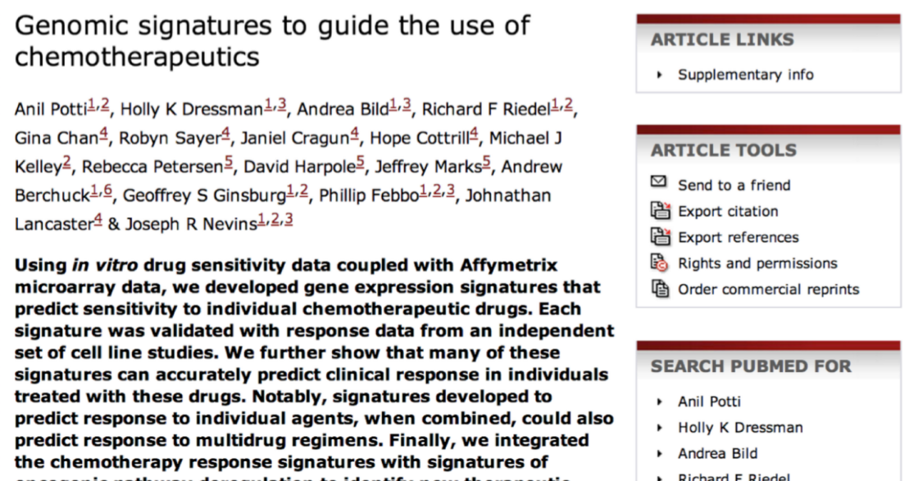
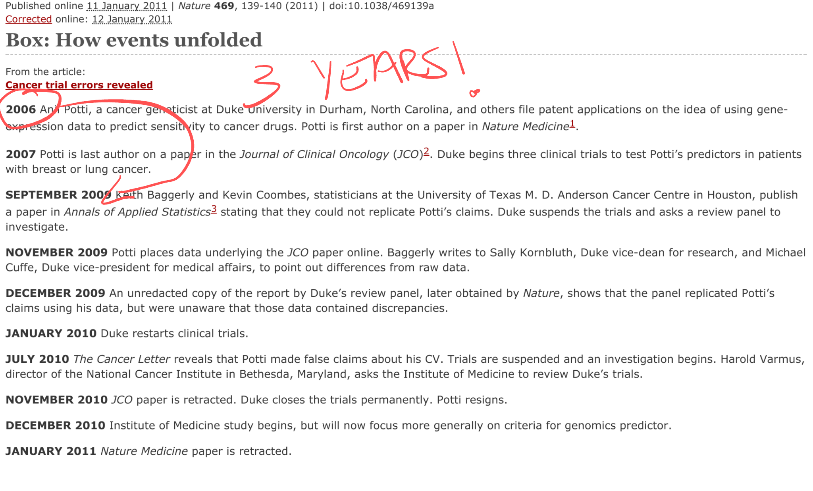
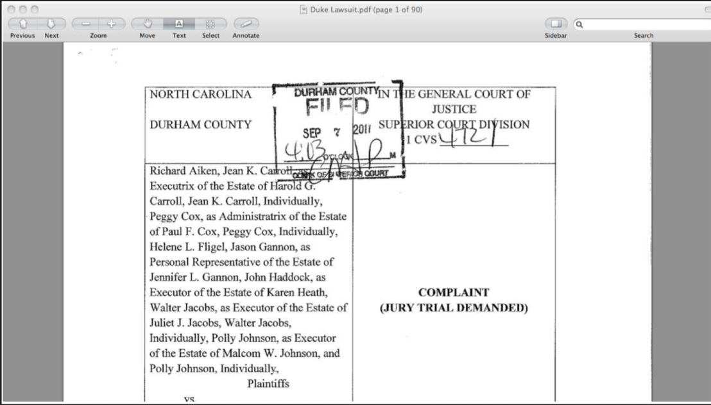
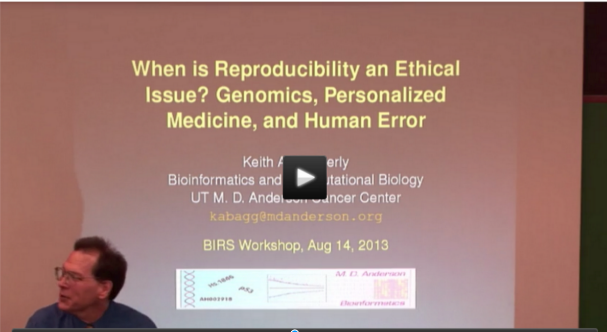
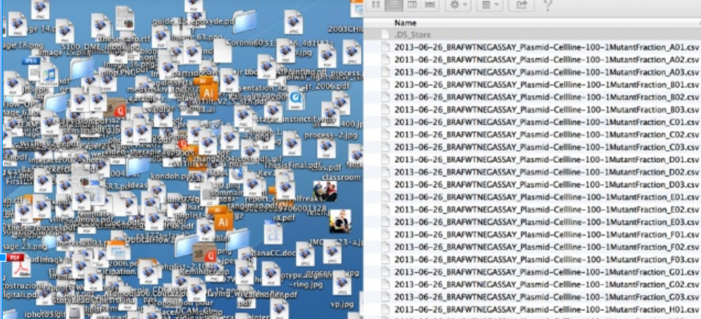
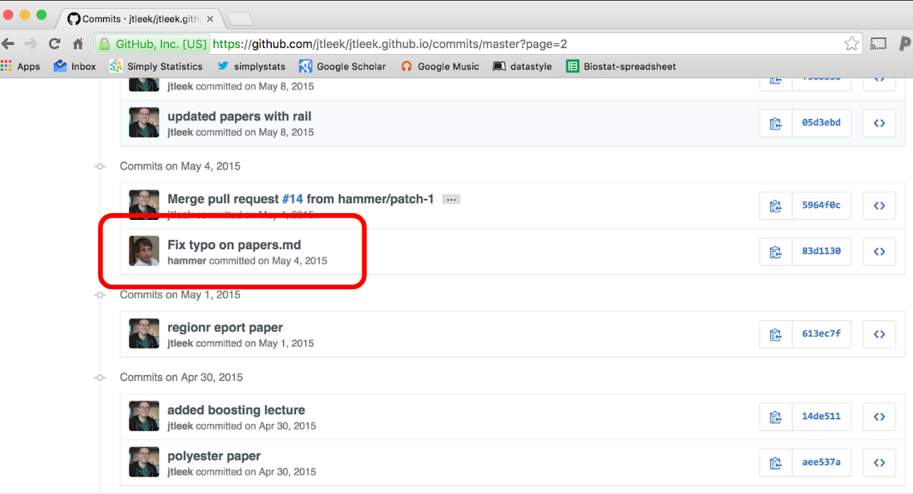
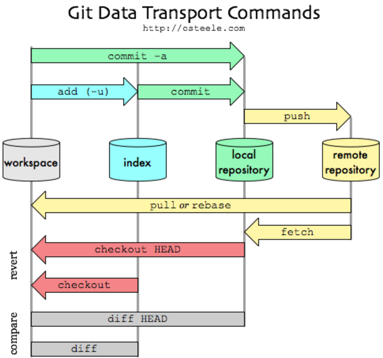
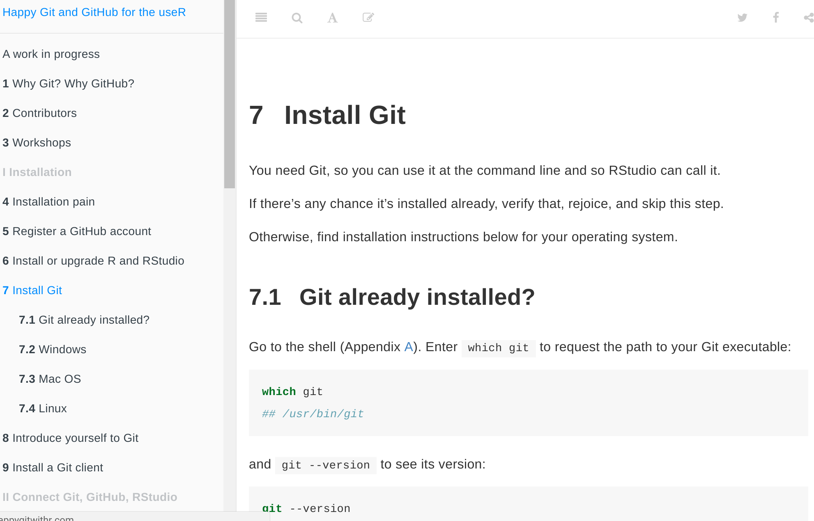
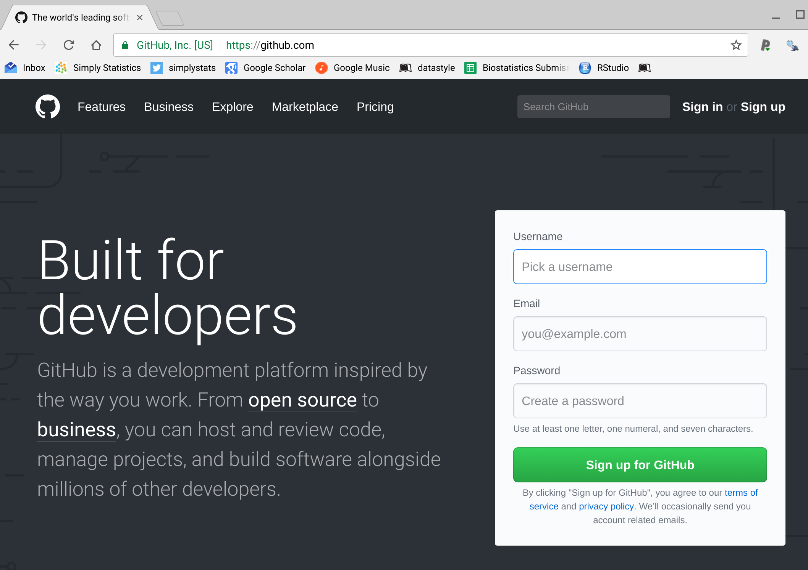

class: center, middle

```{r setup, include=FALSE}
options(htmltools.dir.version = FALSE)
```


<span style="font-size:52px">Motivation<span>


---
class: center, middle

# An exciting result

http://www.nature.com/nm/journal/v12/n11/full/nm1491.html




---

class: center, middle

# Baggerly

https://projecteuclid.org/euclid.aoas/1267453942


---
class: center, middle

# Timeline

http://www.nature.com/news/2011/110111/full/469139a/box/1.html



---
class: center, middle

# Potti Fallout

http://dig.abclocal.go.com/wtvd/docs/Duke_lawsuit_090811.pdf





---
class: center, middle

# Worth a watch!

https://goo.gl/T2nWbC





---
class: center, middle

# Not just the boogeyman

.pull-left[

"Your closest collaborator is you six months ago, but you don’t reply to emails."

-Karl Broman

]

.pull-right[


]

http://kbroman.org/Tools4RR/assets/lectures/06_org_eda.pdf


---
class: center, middle

<span style="font-size:52px">Organizing Projects<span>


---
class: center, middle

.pull-left[

"Your closest collaborator is you six months ago, but you don’t reply to emails."

-Jenny Bryan

]

.pull-right[


]

http://kbroman.org/Tools4RR/assets/lectures/06_org_eda.pdf

---
# Keys to success


*_Step 1_ slow down and document. 
*_Step 2_ have sympathy for your future self. 
*_Step 3_ have a system.

---
class: center,middle

# Not a good plan

http://www.slideshare.net/jenniferbryan5811/cm002-deep-thoughts





---

# One strategy


.pull-left[

* data
    - raw_data
    - processed_data
* figures
    - exploratory_figures
    - final_figures
* code
    - raw_code
    - final_code
    - rmarkdown
* text
    - README
    - writeup
]

.pull-right[

]


---

# One strategy


.pull-left[

* data
    - raw_data
    - processed_data
* figures
    - exploratory_figures
    - final_figures
* code
    - raw_code
    - final_code
    - rmarkdown
* text
    - README
    - writeup
]

.pull-right[
* code/
    * final_code/
        - 0-preprocess.R
        - 1-explore.R
        - 2-model.R
        - 3-final-plots.R

]

---
class: center, middle

# Just...no

https://xkcd.com/1459/


---

# Version control 

* Automatically tracks versions of documents
* Keeps a log of the entire history
* Let’s you “undo” your work
* Let’s you view what you changed


---
class: center, middle

# Unfortunate truth

https://twitter.com/mtrc/status/617075570761965568


---

# Version control options

* __Github__ - where the cool nerds are
* __Bitbucket__ - where the real nerds are
* __svn__ - where the old nerds are
* __Files on your desktop__ - where the frustrated nerds are


---
class: center, middle

# Github

https://github.com/


---
class: center, middle

# Why this is cool




---
class: center,middle

# Git/Github workflow




---
class: center,middle

# Installing Git/Github

http://happygitwithr.com/install-git.html



---
class: center,middle

# Let's do an example



---
class: center, middle

<span style="font-size:52px">Organizing Files<span>


---
# Three* principles of naming things

.pull-left[

* machine readable
* human readable
* plays well with default ordering
* easy to type (added by me)
]

.pull-right[

]

https://goo.gl/6cv4wV

