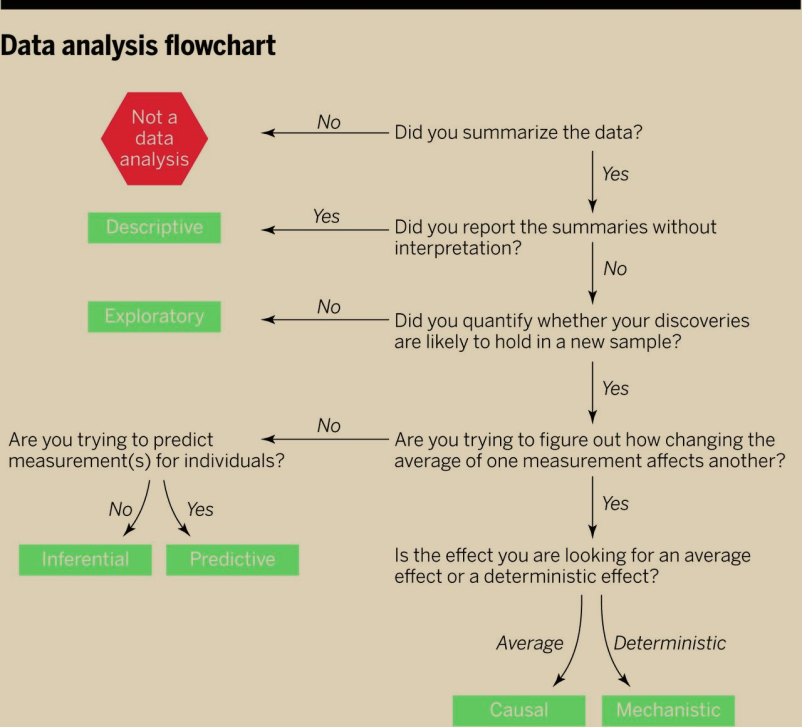

```{r setup, include=FALSE}
options(htmltools.dir.version = FALSE)
```

class: middle

<!--
Here's a fullscreen image.
-->

http://www.sciencemag.org/content/347/6228/1314

```{r flowchart, out.width = "80%", echo = FALSE}

```


---

## The central dogma of statistics

```{r dogma, out.width = "90%", echo = FALSE}
knitr::include_graphics("../imgs/getting_data/dogma.png")
```

http://www.gs.washington.edu/academics/courses/akey/56008/lecture/lecture2.pdf

---

```{r, eval=FALSE}
library(tidyverse)

data %>%
  mutate(xgene = Sugar + Spice) %>%
  filter(Attribute = "Everything-Nice") %>%
  group_by(Location) %>%
  summarise(Meanness = mean(Ness))
```

<!--
Whoa is this great code or what? I'm an elite hacker.
-->

---

.pull-left[

## Lefties

- Babe Ruth
- Ty Cobb
- Lou Gehrig
- Ken Griffey, Jr.

]

.pull-right[

## Right-Wing

- Mitt Romney
- Colin Powell
- John McCain
- Lindsey Graham

]

<!--
Baseball is a wonderful sport. We will study baseball data in depth in this
course.
-->

---

## Witty Insight

- Fact we all understand
- Generalization that is probably true
- Well-formed thought

## Consequences

1. Risky conjecture
2. Big opportunity
3. Synergies?

<!--
Here are a few ideas to ponder.
-->

