class: center, middle

# What you wish data looked like

```{r setup, include = FALSE}
options(htmltools.dir.version = FALSE)
source("../slide_functions.R")
```

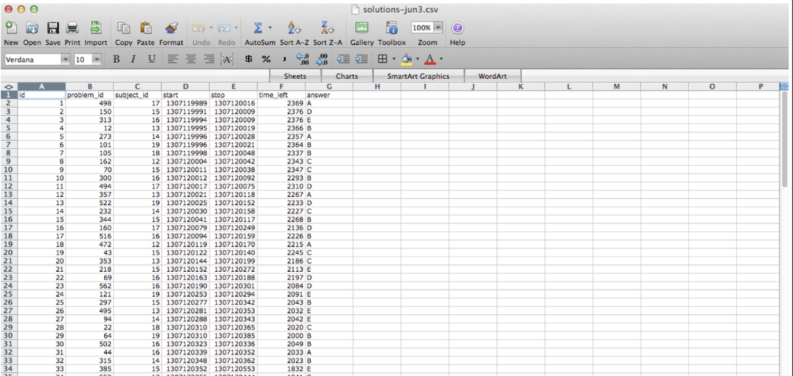

---
class: center, middle
# What it actually looks like


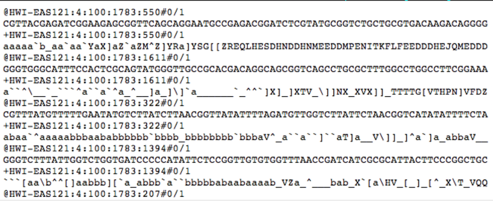


---
class: center, middle
# What it actually looks like

https://dev.twitter.com/docs/api/1/get/blocks/blocking

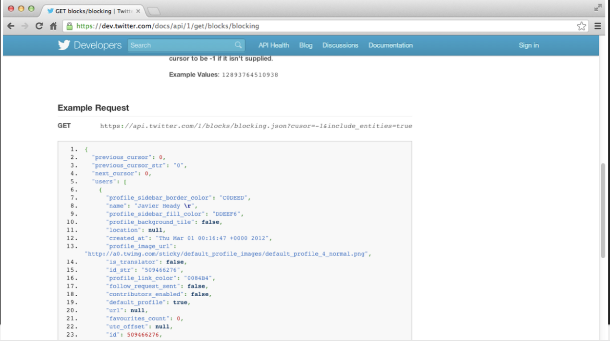

---
class: center, middle
# What it actually looks like

http://healthdesignchallenge.com/

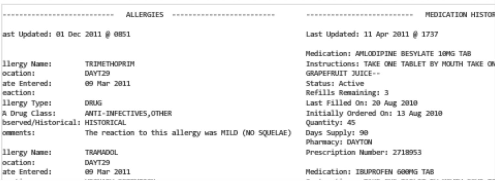

---
class: center, middle
# Spreadsheet tales


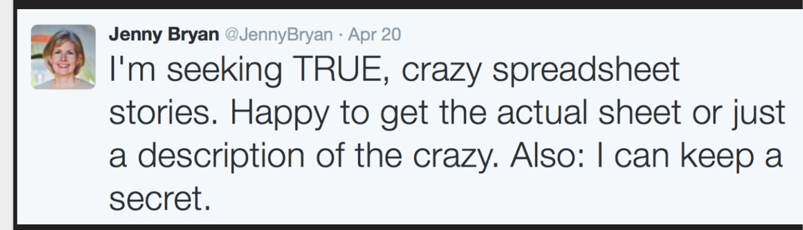


---
class: center, middle
# It gets very crazy

https://github.com/jennybc/2016-06_spreadsheets/blob/master/2016-06_useR-stanford.pdf

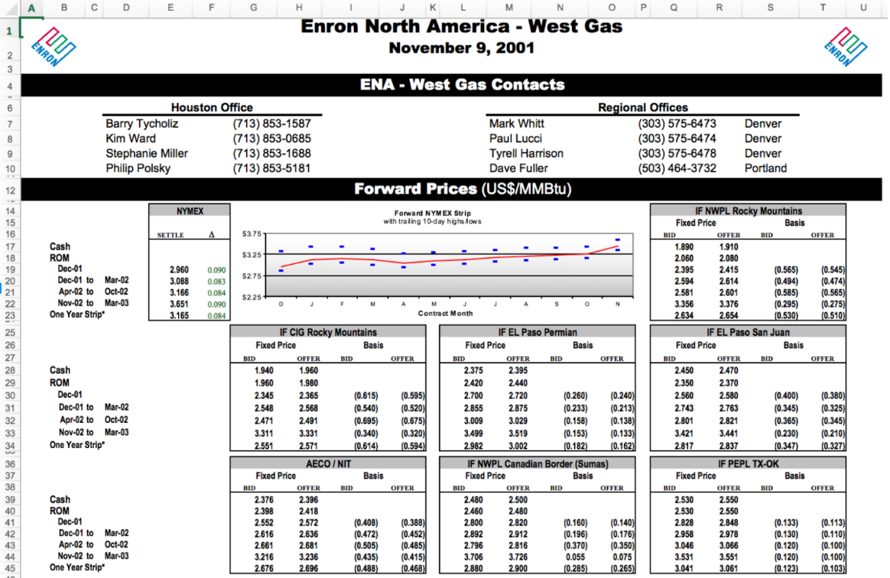

---
class: center, middle
# Other people's data

[#otherpeoplesdata](https://twitter.com/search?q=%23otherpeoplesdata)

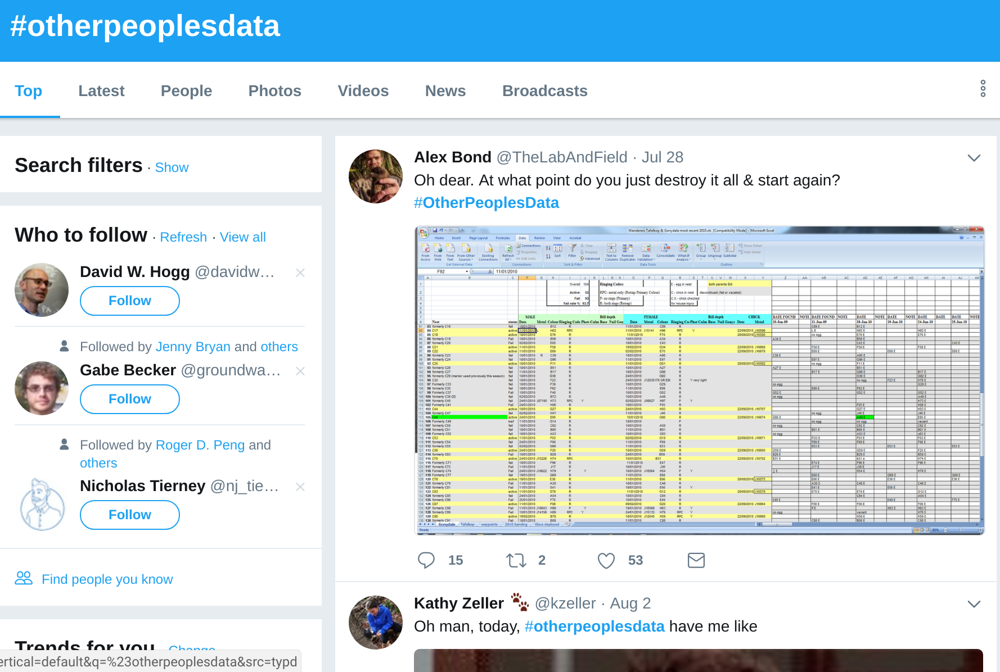

---
class: center, middle
# Where you wish data were


---
class: center, middle
# Where they actually are

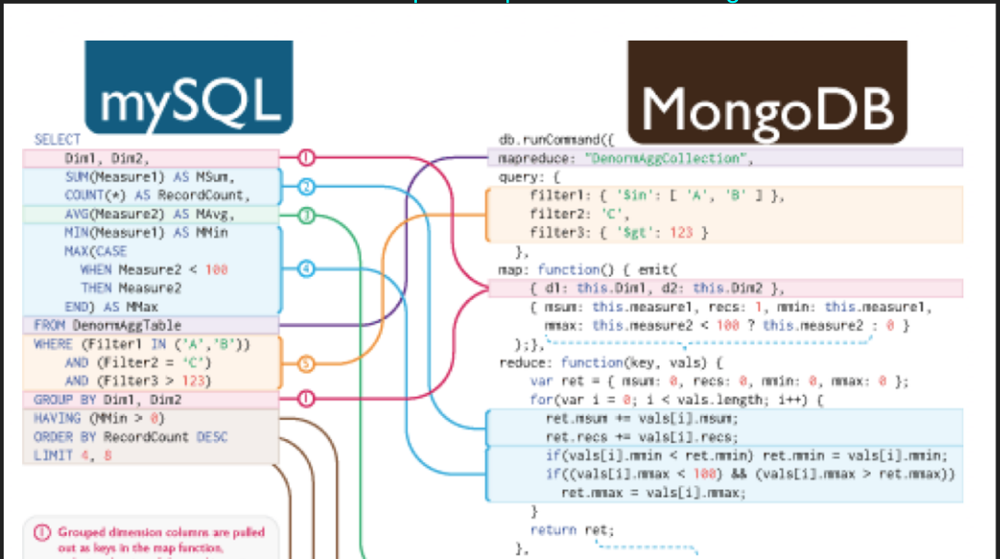

---
class: center, middle
# What they actually are

https://dev.twitter.com/docs/api/1/get/blocks/blocking


---
class: center, middle
# What they actually are

https://data.baltimorecity.gov

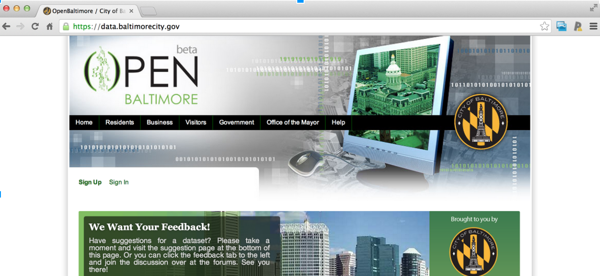


---
class: center, middle
# Our plan

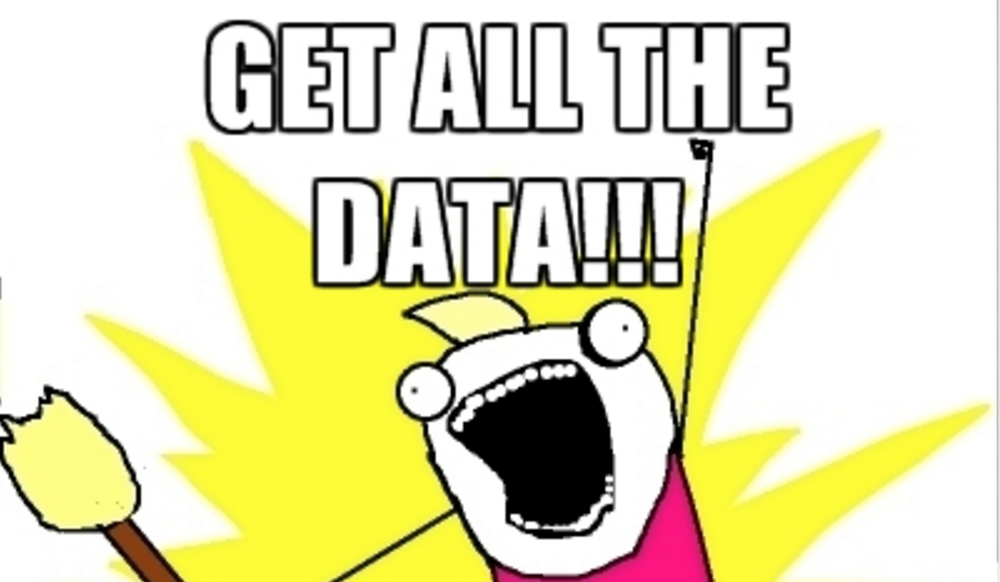


---
class: center, middle

# Data brainstorming

<span style="font-size:52px">https://goo.gl/9j3T7y<span>


---
class: center, middle
# What are data? 

http://en.wikipedia.org/wiki/Data

<span style="font-size:52px">Data are values of qualitative or quantitative variables, belonging to a set of items.<span>

---
class: center, middle
# Relativity of raw data

https://simplystatistics.org/2016/07/20/relativity-raw-data/

<span style="font-size:40px"> ...raw data is raw to you if you have done no processing, manipulation, coding, or analysis of the data. In other words, the file you received from the person before you is untouched. But it may not be the rawest version of the data. The person who gave you the raw data may have done some computations. They have a different "raw data set"..<span>

---
class: center, middle
# The relativity of raw data - example


---
class: center, middle
# The relativity of raw data - example

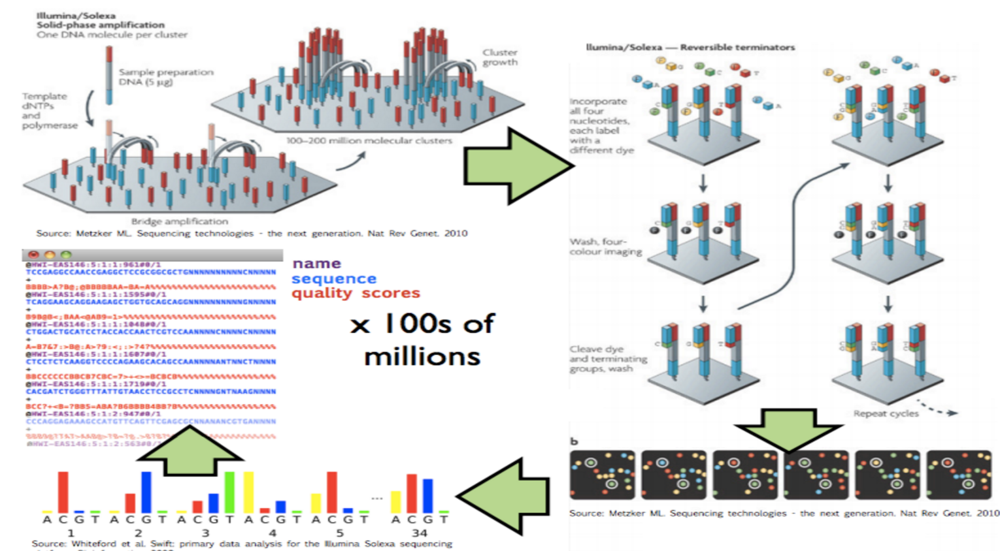


---
class: center, middle

# How to share data


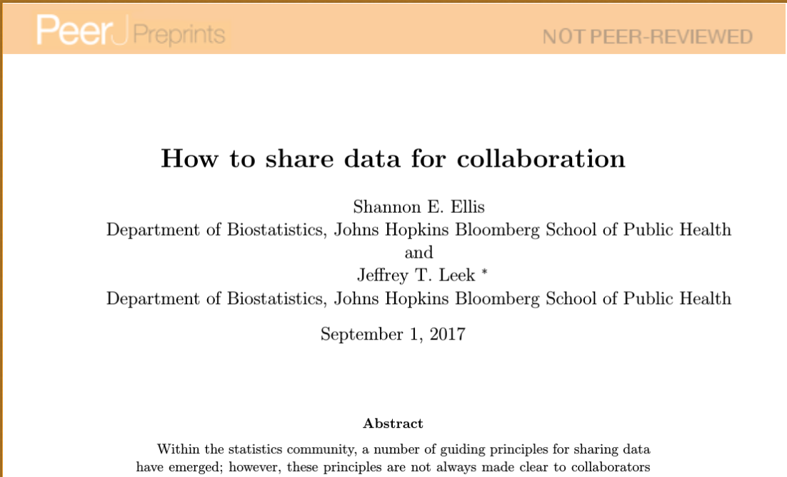


---
# The four parts


1. The raw data.
2. A tidy data set
3. A code book describing each variable and its values in the tidy data set.
4. An explicit and exact recipe you used to go from 1 -> 2,3

---
class: center, middle

# Raw data


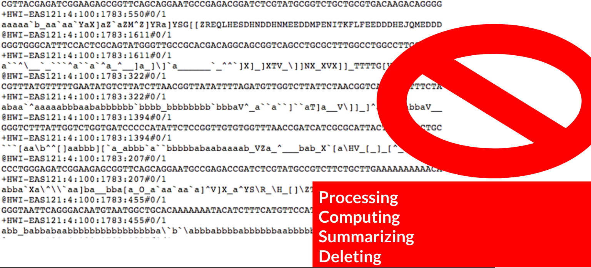

---
class: center, middle

# Tidy data


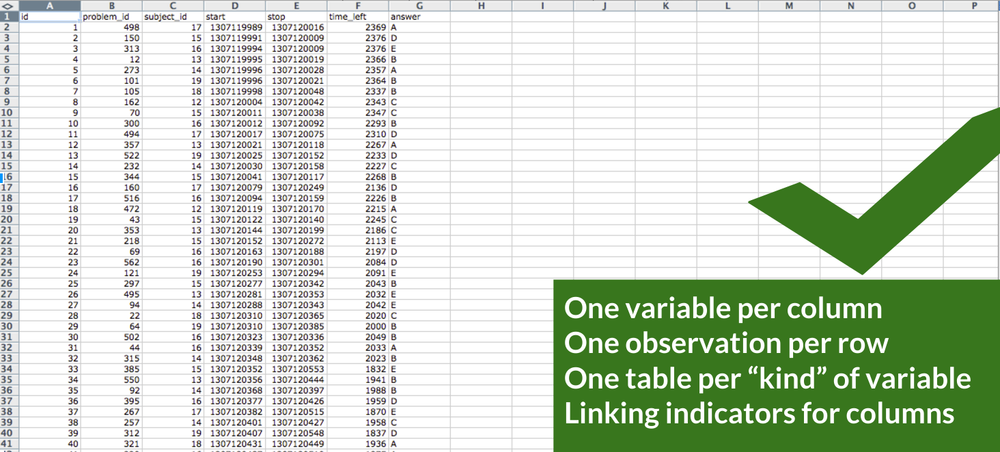

---
class: center, middle

# Code book


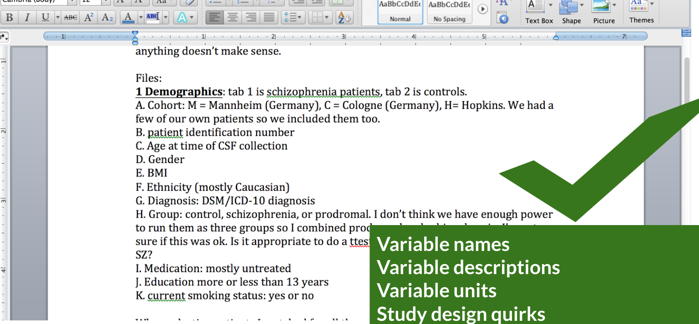

---
class: center, middle

# Recipe


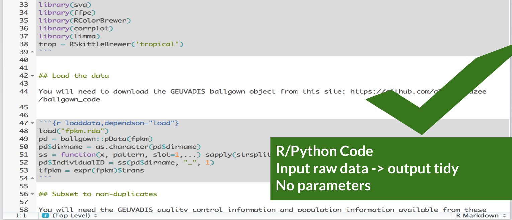

---
class: center, middle

# Recipe


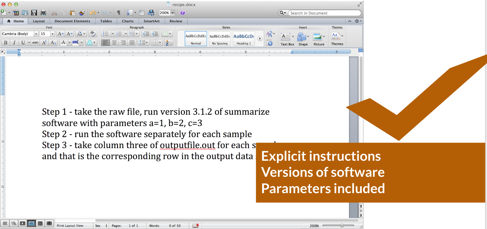

---
class: center, middle

# Recipe


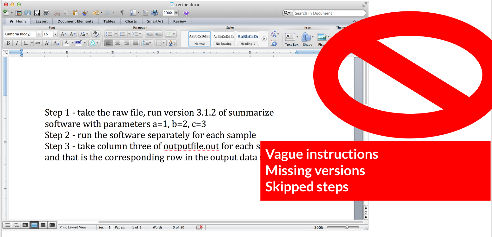


---
class: center, middle

<span style="font-size:52px">Getting data<span>


---
# Relative versus absolute paths

.pull-left[
__Do__
```{r eval=FALSE}
setwd("../data")
setwd("./files")
setwd("..\tmp")
```

]
.pull-right[
__Don't__
```{r eval=FALSE}
setwd("/Users/jtleek/data")
setwd("~/Desktop/files/data")
setwd("C:\\Users\\Andrew\\Downloads")
```
]

---
# Finding and creating files

```{r, eval=FALSE}
if(!file.exists("data")){
  dir.create("data")
}
list.files("data")
```

---
# Downloading data

```{r, eval=FALSE}
file_url <- paste0("https://data.baltimorecity.gov/api/",
                   "views/dz54-2aru/rows.csv?accessType=DOWNLOAD")

download.file(file_url,
    destfile="cameras.csv")
list.files(".")
date_downloaded <- date()
date_downloaded
```

---
class: inverse, center, middle

# Google Sheets


---
class: inverse, center, middle

# Google Sheets

```{r one_slie, results='asis', echo = FALSE}
bg_slide("gsheet", 
  folder = "../imgs/getting_data/", 
  suffix = ".png",
  size = "80%",
  title = "https://docs.google.com/spreadsheets"
)
```


```{r gsheets_slide, results='asis', echo = FALSE}
bg_slide("gsheets_jenny", 
  folder = "../imgs/getting_data/", 
  suffix = ".png",
  size = "80%",
  position = "bottom",
  title = "<p style='font-size:20pt'>https://speakerdeck.com/jennybc/googlesheets-talk-at-user2015</p>"
)
```


---
class: inverse, middle

<div style="font-size:28pt">

`r rcode('install.packages("googlesheets")')`

`r rcode('library(googlesheets)')`

<br>
`r rcode('?gs_read')`
<br>
`r rcode('?"cell-specification"')`

</div>


```{r sheet1, results='asis', echo = FALSE}
bg_slide("sheet1", 
  folder = "../imgs/getting_data/", 
  suffix = ".png",
  size = "100%",
  position = "center",
  title = paste0("<p style='font-size:14pt'>", "https://docs.google.com/spreadsheets/d/18KQQd4LY5k8Ucux1MvWCsQGQJlvd0ECTnn-3ixdOKFM/pubhtml", "</p>")
)
```

```{r sheet2, results='asis', echo = FALSE}
bg_slide("sheet2", 
  folder = "../imgs/getting_data/", 
  suffix = ".png",
  size = "100%",
  title = paste0("Publish to the web")
)
```


---
class: inverse, middle

<div style="font-size:24pt">

`r rcode('sheets_url = "https://docs.google.com/spreadsheets')`
`r rcode('/d/18KQQd4LY5k8Ucux1MvWCsQGQJlvd0ECTnn-3ixdOKFM/pubhtml"')`
<br>
<br>
`r rcode('gsurl1 = gs_url(sheets_url)')`
<br>
`r rcode('dat = gs_read(gsurl1)')`

</div>


---
class: inverse, middle, center

# JSON

```{r json, results='asis', echo = FALSE}
bg_slide("json", 
  folder = "../imgs/getting_data/", 
  title = "https://en.wikipedia.org/wiki/JSON")
```


```{r json_matters, results='asis', echo = FALSE}
bg_slide("json", 
  folder = "../imgs/getting_data/", 
  position = "center",
  title = "Why JSON matters")
```


<br><br><br><br><br><br><br><br><br><br><br><br><br><br><br>
<p style='font-size:14pt'>https://developer.github.com/v3/search/</p>

---
# Reading in JSON: jsonlite

```r
github_url = "https://api.github.com/users/jtleek/repos"

install.packages("jsonlite")
library(jsonlite)
jsonData <- fromJSON(github_url)
dim(jsonData)
jsonData$name
```


---

# Data frame structure from JSON

```r
table(sapply(jsonData,class))

dim(jsonData$owner)

names(jsonData$owner)
```

---
class: inverse, middle, center


# Web Scraping


```{r this_is_data, results='asis', echo = FALSE}
bg_slide("this_is_data", 
  folder = "../imgs/getting_data/", 
  position = "bottom",
  size = "80%",
  title = "This is data<p style='font-size:20pt'>.right[http://bowtie-bio.sourceforge.net/recount/]</p>")
```


```{r view_source, results='asis', echo = FALSE}
bg_slide("view_source", 
  folder = "../imgs/getting_data/", 
  size = "80%",
  title = "View Source")
```


```{r computer_sees, results='asis', echo = FALSE}
bg_slide(files_in_order = c("computer_sees", "inspect_element", "copy_xpath"),
  folder = "../imgs/getting_data/", 
  size = "80%",
  titles = c("What the computer sees", "Inspect element", "Copy XPath")
)
```

```{r s_gadget, results='asis', echo = FALSE}
bg_slide(files_in_order = c("selector_gadget", "run_selector_gadget"),
  folder = "../imgs/getting_data/", 
  size = "80%",
  titles = c("Selector Gadget", "Selector Gadget")
)
```

---

## `rvest` package


```{r, eval = FALSE}
recount_url = "http://bowtie-bio.sourceforge.net/recount/"
install.packages("rvest")
library(rvest)
htmlfile = read_html(recount_url)

nds = html_nodes(htmlfile,                
xpath='//*[@id="recounttab"]/table')
dat = html_table(nds)
dat = as.data.frame(dat)
head(dat)
```


```{r okcupid, results='asis', echo = FALSE}
bg_slide("okcupid", 
  folder = "../imgs/getting_data/", 
  size = "80%",
  title = "<p style='font-size:20pt'>http://motherboard.vice.com/read/70000-okcupid-users-just-had-their-data-published</p>"
)
```


```{r guardian, results='asis', echo = FALSE}
bg_slide("guardian", 
  folder = "../imgs/getting_data/", 
  size = "80%",
  title = "<p style='font-size:20pt'>https://www.theguardian.com/science/2012/may/23/text-mining-research-tool-forbidden</p>"
)
```

---
class: inverse, center, middle

# APIs

```{r apis, results='asis', echo = FALSE}
bg_slide("apis", 
  folder = "../imgs/getting_data/", 
  position = "bottom",
  size = "80%",
  title = "Application Programming Interfaces<p style='font-size:20pt'>.right[http://bowtie-bio.sourceforge.net/recount/]</p>")
```


```{r pubmed, results='asis', echo = FALSE}
bg_slide("pubmed", 
  folder = "../imgs/getting_data/", 
  position = "bottom",
  size = "100%",
  title = "In biology too!<p style='font-size:18pt'>.right[http://www.ncbi.nlm.nih.gov/books/NBK25501/]</p>")
```


```{r step0, results='asis', echo = FALSE}
bg_slide("step0", 
  folder = "../imgs/getting_data/", 
  position = "bottom",
  size = "80%",
  title = "Step 0: Did someone do this already<p style='font-size:20pt'>.right[https://ropensci.org/]</p>")
```


```{r figshare, results='asis', echo = FALSE}
bg_slide("figshare", 
  folder = "../imgs/getting_data/", 
  position = "bottom",
  size = "80%",
  title = "Figshare<p style='font-size:20pt'>.right[https://figshare.com]</p>")
```

---

## Figshare API wrapper

```r
install.packages("rfigshare")
library(rfigshare)
leeksearch = fs_search("Leek")

length(leeksearch)
leeksearch[[1]]
```


```{r diy, results='asis', echo = FALSE}
bg_slide("diy", 
  folder = "../imgs/getting_data/", 
  position = "bottom",
  size = "100%",
  title = "Do it yourself")
```


```{r read_docs, results='asis', echo = FALSE}
bg_slide("read_docs", 
  folder = "../imgs/getting_data/", 
  position = "bottom",
  size = "100%",
  title = "Read the docs")
```


```{r api_limit, results='asis', echo = FALSE}
bg_slide("api_limit", 
  folder = "../imgs/getting_data/", 
  size = "100%",
  title = "Read the docs")
```


```{r example_query, results='asis', echo = FALSE}
bg_slide("example_query", 
  folder = "../imgs/getting_data/", 
  size = "100%",
  title = "Example query")
```

---
class: middle

# A dissected example

<p style='font-size:30pt'>

<font color="lightgray">https://api.github.com/search/repositories?q=created:2014-08-13+language:r+-user:cran&type </font>

</p>


---
class: middle

# Base URL

<p style='font-size:30pt'>

https://api.github.com/<font color="lightgray">search/repositories?q=created:2014-08-13+language:r+-user:cran&type</font>

</p>


---
class: middle

# The Path: Search repositories

<p style='font-size:30pt'>

<font color="lightgray">https://api.github.com/</font>search/repositories<font color="lightgray">?q=created:2014-08-13+language:r+-user:cran&type</font>

</p>


---
class: middle

# Create a query

<p style='font-size:30pt'>

<font color="lightgray">https://api.github.com/search/repositories</font>?q=created:2014-08-13+language:r+-user:cran&type

</p>


---
class: middle

# Date repo was created

<p style='font-size:30pt'>

<font color="lightgray">https://api.github.com/search/repositories?q=</font>created:2014-08-13<font color="lightgray">+language:r+-user:cran&type</font>

</p>


---
class: middle

# Language repo is in

<p style='font-size:30pt'>

<font color="lightgray">https://api.github.com/search/repositories?q=created:2014-08-13</font>+language:r<font color="lightgray">+-user:cran&type</font>

</p>


---
class: middle

# Ignore repos from CRAN

<p style='font-size:30pt'>

<font color="lightgray">https://api.github.com/search/repositories?q=created:2014-08-13+language:r</font>+-user:cran&type

</p>


---
## Using httr to call the API

```{r, eval = FALSE, echo = TRUE}
install.packages("httr")
library(httr)

query_url = paste0("https://api.github.com/search/",
"repositories?q=created:2014-08-13+language:r+-user:cran")

req = GET(query_url)
names(content(req))
```


```{r non_open_apis, results='asis', echo = FALSE}
bg_slide("non_open_apis", 
  folder = "../imgs/getting_data/", 
  position = "bottom",
  size = "100%",
  title = 'Not all APIs are "open"')
```


---
# Authentication!

```{r, eval = FALSE, echo = TRUE}
myapp = oauth_app(
  "twitter",
  key="yourConsumerKeyHere",
  secret="yourConsumerSecretHere")
sig = sign_oauth1.0(
  myapp,
  token = "yourTokenHere",
  token_secret = "yourTokenSecretHere")
homeTL = GET("https://api.twitter.com/1.1/statuses/home_timeline.json", 
             sig)
```


---
## But you can get cool data

```
json1 = content(homeTL)
json2 = jsonlite::fromJSON(toJSON(json1))
json2[1,1:4]

                    created_at           id             id_str
1 Mon Jan 13 05:18:04 +0000 2014 4.225984e+17 422598398940684288
                                                                                                                                         text
1 Now that P. Norvig's regex golf IPython notebook hit Slashdot, 
let's see if our traffic spike tops the previous one: http://t.co/Vc6JhZXOo8
```


---
## Summary


* `httr` to interact with the web (VERBS like GET/PUT)


* `rvest` to grab all the exact elements you want
    - Check out selector gadget 
    

* `googlesheets` for ... Google Sheets
* `googledrive` (http://googledrive.tidyverse.org/) just came out


* `jsonlite` for JSON
