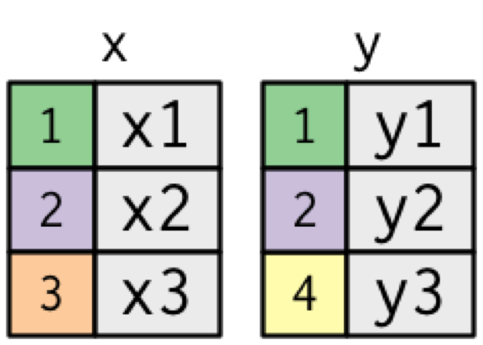
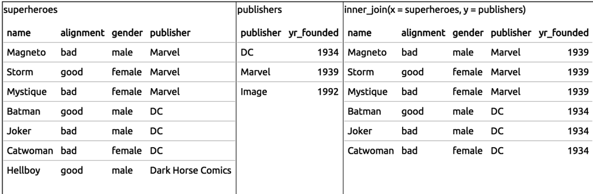
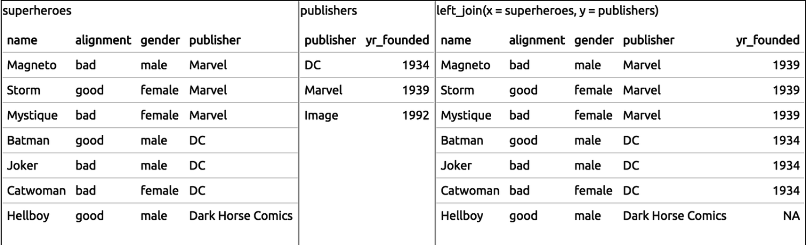
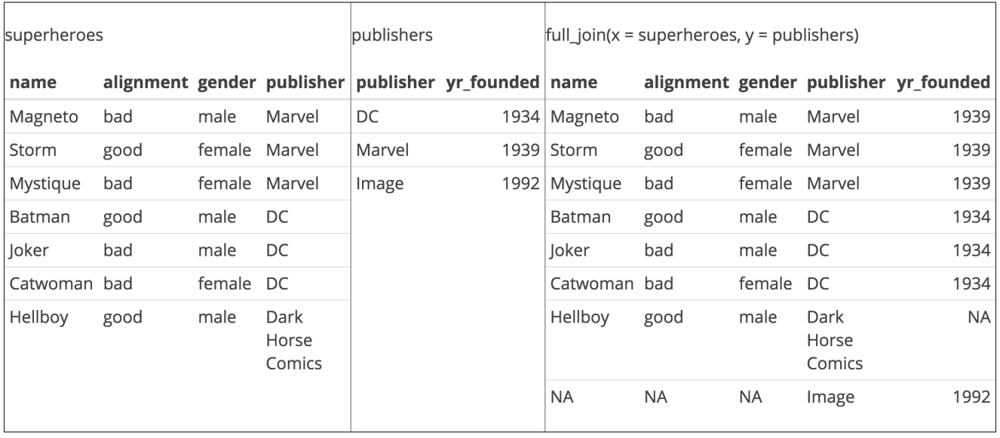

class: inverse, center, middle

# dplyr

```{r setup, include = FALSE}
knitr::opts_chunk$set(comment = "")
muffleError <- function(x,options) {}
reg_error_hook = knitr::knit_hooks$get("error")
options(htmltools.dir.version = FALSE)
source("../slide_functions.R")
folder = "../imgs/manipulating_data/"
```

---
## dplyr verbs

* `filter` (and `slice`) : select rows

--

* `arrange`: order rows

--

* `select` (and `rename`) : order/rename columns

--

* `distinct`: find distinct rows

--

* `mutate` (and `transmute`): add new variables

--

* `summarise`: summarize across a data set

--

* `sample_n` and `sample_frac`: sample from a data set

--

* `group_by`: Group data by varaible(s)


---

## Gapminder Example

```{r, eval = FALSE}
install.packages("gapminder")
```
```{r, warning=FALSE, message=FALSE}
library(dplyr)
library(gapminder)
str(gapminder)
gtbl = gapminder
```

```{r gapminder, results='asis', echo = FALSE}
bg_slide("gapminder", 
  folder = folder,
  size = "100%",
  title = "Gapminder Example")
```

.footnote[https://www.ted.com/talks/hans_rosling_shows_the_best_stats_you_ve_ever_seen?language=en]

---
class: inverse

## Glimpse - a better `str`

```{r}
glimpse(gtbl)
```

---
class: inverse

## Select rows and columns

```{r}
filter(gtbl, lifeExp < 29)
```

--

```{r}
select(gtbl, country, year, pop)
```

---
class: inverse

## Order rows ascending and descending

```{r}
arrange(gtbl, pop) %>% head(3)
```

--

```{r}
arrange(gtbl, desc(pop)) %>% head(3)
```

---
class: inverse

## Add new columns

```{r}
gtbl = mutate(gtbl, newVar = lifeExp / gdpPercap)
select(gtbl, lifeExp,gdpPercap,newVar) %>% head(3)
```

---
class: inverse

## Distinct: a better `unique` for data sets

```{r}
sub_gtbl = select(gtbl, country, year)
distinct(sub_gtbl)
```


```{r big_data, results='asis', echo = FALSE}
bg_slide(files_in_order = c("big_data", "careful"),
  folder = folder,
  title = rep("Key principle of big data", 2)
)
```


```{r dogma, results='asis', echo = FALSE}
bg_slide(c("dogma"),
  folder = folder,
  size = "90%",
  title = "Central dogma of statistics")
```

---
class: inverse

## Sampling

```{r}
n1000 = sample_n(gtbl, 1000)
```

```{r}
pct0.5= sample_frac(gtbl, 0.5)
dim(pct0.5)
```

<font style='font-size:30pt'>
Also good with `group_by` for stratified sampling.
</font>

---
class: inverse, middle, center

# Pipes

---
class: inverse, middle, center

# %>%

<font style='font-size:30pt'>
Read as "then"
</font>

<br>
<font style='font-size:30pt'>
http://cran.r-project.org/web/packages/magrittr/index.html
</font>

---
class: inverse, middle

# Piping stuff

```{r, eval = TRUE}
gtbl %>% head(3)
```

<font style='font-size:30pt'>
RStudio does tab completion with column names of a data set.
<br>
No more "what did I call that variable again?"
</font>


---
class: inverse, middle, center

# Uh...big deal?

---
class: inverse, center, middle

## Example

<font color="yellow"  style='font-size:30pt'>
Show me a random sample of size 10 for the data of Asian countries with life expectancy < 65.
</font>


---
class: inverse

## In base R:

```{r, eval = FALSE}
 # new table
gtbl1 = gtbl[gtbl$continent=="Asia",]

 # reassignment
gtbl2 = gtbl1[gtbl1$lifeExp < 65,]

# functions in brackets
gtbl3 = gtbl2[sample(1:dim(gtbl2)[1],size=10),]

gtbl3
```

---
class: inverse

## With pipes + dplyr

```{r, eval = FALSE}
gtbl %>% 
  filter(continent == "Asia") %>% 
  filter(lifeExp < 65) %>%
  sample_n(10)

gtbl %>% 
  filter(continent == "Asia", lifeExp < 65) %>%
  sample_n(10)

gtbl %>% 
  filter(continent == "Asia" & lifeExp < 65) %>%
  sample_n(10)
```


---
class: inverse

## Getting complicated, but readable

```{r}
gtbl %>% 
  filter(year > 1960) %>%
  group_by(country) %>% 
  sample_n(10) %>% 
  mutate(pop_exp = pop / lifeExp,
         sampled = TRUE)
```

---
class: inverse, center, middle

## Example 2

<font color="yellow"  style='font-size:30pt'>
What is the average life expectancy by continent?
</font>


---
class: inverse

## With pipes + dplyr
```{r, eval = TRUE}
gtbl %>% 
  group_by(continent) %>% 
  summarize(aveLife = mean(lifeExp))
```

---
class: inverse

## Multiple Summarizations: just add more

```{r, eval = TRUE}
gtbl %>% 
  group_by(continent) %>% 
  summarize(aveLife = mean(lifeExp),
            n = n())
```


---
class: inverse

# Common Summarization options 

- mean:  mean within groups

- sum:  sum within groups

- sd:  standard deviation within groups

- max:  max within groups

- ...  ...

dplyr functions:

- `n()`:  number in each group
- `first()`:  first in group
- `last()`:  last in group
- `nth(n=3)`:  nth in group (3rd here)

- `tally()` is short-hand for `summarise(n = n())` (see `add_tally`)
- `count()` is a short-hand for `group_by() + tally()` (see `add_count`)


---
class: inverse, middle, center

# dplyr lab

<font color="red"  style='font-size:40pt'>
https://goo.gl/bryfeH
</font>


---
class: inverse, middle, center

# Merging Data Sets

---
class: inverse, middle, center

# The worst and most common task


```{r joins, results='asis', echo = FALSE}
bg_slide("joins", 
  folder = folder)
```

.footnote[https://www.blubgoo.com/sql-join-overview/]


```{r relational, results='asis', echo = FALSE}
bg_slide(
  "relational", 
  size = "60%",
  folder = folder)
```

.footnote[http://r4ds.had.co.nz/relational-data.html]

```{r inner_join, results='asis', echo = FALSE}
bg_slide(c("inner_join", "left_join", "full_join"),
  folder = folder,
  title = paste0(c("Inner Join", "Left Join", "Full Join"),
                 '')
)
```

.footnote[http://r4ds.had.co.nz/relational-data.html]


---
class: inverse

## Superheroes Example

```{r}
superheroes <-
  c("    name, alignment, gender,         publisher",
    " Magneto,       bad,   male,            Marvel",
    "   Storm,      good, female,            Marvel",
    "Mystique,       bad, female,            Marvel",
    "  Batman,      good,   male,                DC",
    "   Joker,       bad,   male,                DC",
    "Catwoman,       bad, female,                DC",
    " Hellboy,      good,   male, Dark Horse Comics")
superheroes <- read.csv(text = superheroes, 
                        strip.white = TRUE)
head(superheroes)
```

.footnote[http://stat545.com/bit001_dplyr-cheatsheet.html]


---
class: inverse

## Superheroes Example

```{r}
publishers <- 
  c("publisher, yr_founded",
    "       DC,       1934",
    "   Marvel,       1939",
    "    Image,       1992")
publishers <- read.csv(text = publishers, 
                       strip.white = TRUE)
head(publishers)
```

.footnote[http://stat545.com/bit001_dplyr-cheatsheet.html]

---

```{r}
ijsp = inner_join(superheroes, publishers)
```



.footnote[http://stat545.com/bit001_dplyr-cheatsheet.html]

---

```{r}
ljsp = left_join(superheroes, publishers)
```



.footnote[http://stat545.com/bit001_dplyr-cheatsheet.html]


---

```{r}
fjsp = left_join(superheroes, publishers)
```



.footnote[http://stat545.com/bit001_dplyr-cheatsheet.html]

---
class: inverse, middle, center

# Merging lab

<font color="red"  style='font-size:40pt'>
https://goo.gl/Z3hqyT
</font>

```{r, results='asis', echo = FALSE}
center_slide("dplyr + databases")
```

---
class: inverse
layout: false

## "flat files" vs. databases

<!-- .left-column-equal[Flat files -->
.pull-left[Flat files
- Formats
    - .csv, .xlsx, .txt, ...

- How used
    - Usually read into RAM

- Good for
    - Small/medium sized data 

- Disadvantage
    - Big data = big computer
    - Slow reading
]
<!-- .right-column-equal[ -->
.pull-right[Databases

- Formats
  - sqllite, postgres, mongodb
  
- How used
    - Data stays on disk

- Good for
    - Big data  

- Disadvantage
    - Low interactivity
    - Potentially slow I/O
]


```{r database, results='asis', echo = FALSE}
bg_slide("database", 
  folder = folder)
```

.footnote[http://r4ds.had.co.nz/relational-data.html]
---
class: inverse
## Setup

```{r, eval = TRUE}
# install.packages("dplyr")
# install.packages("babynames")
# install.packages("pryr")
library(dplyr)
library(babynames)
library(pryr)
```

---
class: inverse

## Checking out babynames

```{r, eval = FALSE}
?babynames
View(babynames)
```
```{r}
str(babynames)
pryr::object_size(babynames)
```

---
class: inverse

## Getting set up

```{r}
my_db <- src_sqlite("my_db.sqlite3", create = TRUE)
babys_sqlite <- copy_to(my_db, babynames, 
                        temporary = FALSE,
                        overwrite = TRUE)
src_tbls(my_db)
tbl(my_db,"babynames")
```

---
class: inverse

## Now you can use dplyr just like before!

```{r}
newtbl = my_db %>% 
  tbl("babynames")%>% 
  filter( name == "Hilary") %>% 
  select(year,n,name, sex)
```

--

`dplyr` waits to access the database. Here it only gets the first 10 rows:
```{r}
newtbl
```

--

---
class: inverse

## Now you can use dplyr just like before!

```{r}
newtbl = my_db %>% 
  tbl("babynames") %>% 
  filter(name=="Hilary") %>% 
  select(year,n,name, sex)
```

`collect()` asks for the whole result
```{r}
output = newtbl %>% collect()
dim(output)
```


---
class: inverse

```{r, fig.width = 12, fig.height = 6}
library(ggplot2)
output %>% 
  filter(year > 1930) %>% 
  ggplot(aes(x = year, y = n, colour = sex)) + 
  geom_line() + ggtitle("Incidence of babies named Hilary") +
  theme(legend.position = c(0.25, 0.75))
```
---
class: inverse

## Top 100 Baby Names: `data.frame`.

```{r}
popular = babynames %>%
  
  group_by(name) %>%
  summarise(N = sum(n)) %>%
  arrange(desc(N)) %>% 
  
  top_n(100)
```

.footnote[http://cpsievert.github.io/slides/intro/#44]


---
class: inverse

## Top 100 Baby Names: database

```{r}
popular = my_db %>%
  tbl("babynames")%>%
  group_by(name) %>%
  summarise(N = sum(n)) %>%
  arrange(desc(N)) %>% 
  
  top_n(100)
```


This won't work out of the box as `rank` is not supported for this database (so `top_n` is not either)

--

```{r, eval = FALSE}
popular
```
```
Error: Window function `rank()` is not supported by this database
```

.footnote[http://cpsievert.github.io/slides/intro/#44]

---
class: inverse

## Top 100 Baby Names: database

```{r}
popular = my_db %>%
  tbl("babynames")%>%
  group_by(name) %>%
  summarise(N = sum(n)) %>%
  arrange(desc(N)) %>% 
  collect() %>% 
  top_n(100)
```

--

```{r}
popular %>% head(3)
```


.right[
.footnote[http://cpsievert.github.io/slides/intro/#44]
]
---
class: inverse

## Operations in Databases

- basic math operators: +, -, *, /, %%, ^

- math functions: abs, acos, acosh, asin, asinh, atan, atan2, atanh, ceiling,
  cos, cosh, cot, coth, exp, floor, log,log10, round, sign, sin, sinh, sqrt, tan,
  tanh
- logical comparisons: <, <=, !=, >=, >, ==, %in%

- boolean operations: &, &&, |, ||, !, xor

- basic aggregations: mean, sum, min, max, sd, var

.footnote[https://cran.r-project.org/web/packages/dplyr/vignettes/databases.html]

---
class: inverse

## SQL Translation!

```{r}
suppressPackageStartupMessages({library(dbplyr)})
translate_sql(filter(name=="James"))
translate_sql(filter(df,name=="James"))
translate_sql(summarize(group_by(df), mean(x)))
```

---
class: inverse

## SQL Translation with pipes

```{r}
translate_sql({
  df %>% 
    group_by(continent) %>% 
    summarize(x = mean(x))
  })
```

---
class: inverse

## Explain details: runs SQL EXPLAIN (query plan)

```{r}
how_female = my_db %>% 
  tbl("babynames") %>% 
  group_by(name) %>% 
  summarize(m = mean(sex == "F"))

explain(how_female)
```

```{r, results='asis', echo = FALSE}
center_slide("Databases lab")
```

<font color="red"  style='font-size:40pt'>
https://goo.gl/ekBcv1
</font>


```{r, results='asis', echo = FALSE}
center_slide("When tidy won't do")
```

```{r nmeth, results='asis', echo = FALSE}
bg_slide("nmeth", 
  folder = folder)
```
.footnote[http://www.nature.com/nmeth/journal/v12/n2/full/nmeth.3252.html]

```{r, results='asis', echo = FALSE}
center_slide("tidygenomics")
```
```{r, eval = FALSE}
install.packages("tidygenomics")
```

```{r, include = FALSE}
file.remove("my_db.sqlite3")
```

