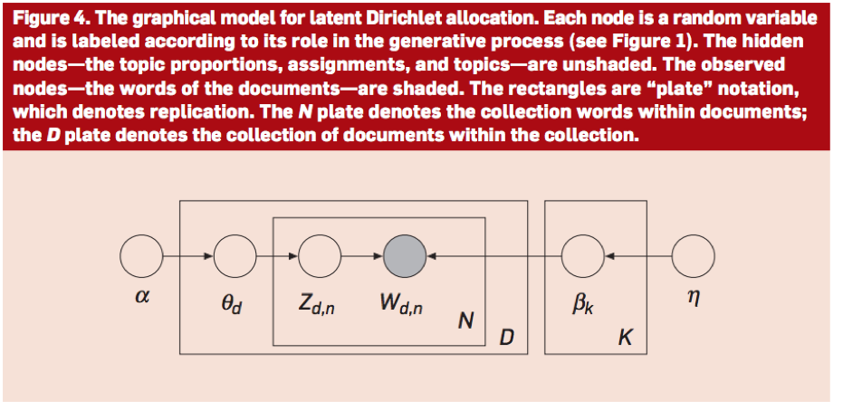
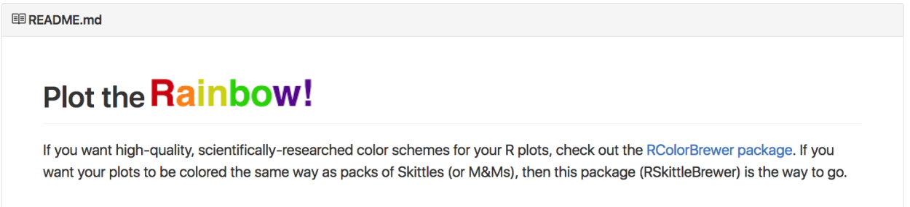
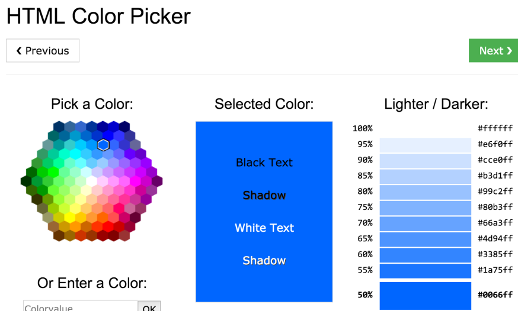

class: inverse, middle, center


# Topic Models is a 

> type of statistical model for discovering the abstract "topics" that occur in a collection of documents. Topic modeling is a frequently used text-mining tool for discovery of hidden semantic structures in a text body.

.footnote[https://en.wikipedia.org/wiki/Topic_model]


```{r setup, include = FALSE}
knitr::opts_chunk$set(comment = "")
muffleError <- function(x,options) {}
reg_error_hook = knitr::knit_hooks$get("error")
options(htmltools.dir.version = FALSE)
source("../slide_functions.R")
folder = "../imgs/topic/"
library(tm)
suppressPackageStartupMessages({library(dplyr)})
```


```{r latent, results='asis', echo = FALSE}
bg_slide("latent", 
  folder = folder,
  size = "80%",
  add_opts = "class: inverse")
```

.footnote[https://www.cs.princeton.edu/~blei/papers/BleiNgJordan2003.pdf]

```{r genetic_paper, results='asis', echo = FALSE}
bg_slide("genetic_paper", 
  folder = folder,
  size = "80%",
  add_opts = "class: inverse")
```

.footnote[https://www.cs.princeton.edu/~blei/papers/Blei2012.pdf]

---
class: inverse

## Topic: A probability distribution over a fixed vocabulary

<div style='font-size:30pt'>
Conceptual algorithm:
</div>
<br>
<div style='font-size:30pt'>

1. Randomly choose a distribution over topics
<br>
2. For each word in the document
    Randomly choose a topic using 1.
    Randomly choose a word using the topic. 
</div>


---
class: inverse



.pull-left[
- β - topic distribution
- w - observed words 
- θ - topic proportions in document
- z - topic assignment in document
]
.pull-right[
- α -  prior on proportions
- D - \# of documents
- K - \# of topics
- η  - prior on # of topics
]


```{r real_inf, results='asis', echo = FALSE}
bg_slide(c("real_inf", "real_inf_hand"),
  folder = folder,
  size = "100%",
  add_opts = "class: inverse")
```


---
class: inverse, middle, center

# Topic models lab

<font color="red"  style='font-size:40pt'>
https://goo.gl/0bcib4
</font>


---
class: inverse, middle, center

# Exploratory data analysis


```{r book, results='asis', echo = FALSE}
bg_slide("book", 
  folder = folder,
  size = "40%",
  add_opts = "class: inverse",
  titles = "A good book")
```

.footnote[https://leanpub.com/exdata]

---
class: inverse

## Steps in an EDA

.huge[
.pull-left[
- Read in data
- Figure out what it is
- Pre-process it
- Look at dimensions
- Look at values (str)
]
.pull-right[
- Make tables
- Hunt for messed up values
- Hunt for NAs
- Plot it
- Don't fool yourself
]
]


```{r cv, results='asis', echo = FALSE}
bg_slide("vc", 
  folder = folder,
  size = "60%",
  add_opts = "class: inverse",
  titles = "Example")
```

```{r elephant, results='asis', echo = FALSE}
bg_slide("elephant", 
  folder = folder,
  size = "80%",
  add_opts = "class: inverse"
)
```

.footnote[https://en.wikipedia.org/wiki/Blind_men_and_an_elephant#/media/File:Blind_monks_examining_an_elephant.jpg]


```{r nature, results='asis', echo = FALSE}
bg_slide("nature", 
  folder = folder,
  size = "80%",
  add_opts = "class: inverse"
)
```

---
class: inverse

## simplystats data - what is it? 

```{r ss, cache = TRUE, message = FALSE}
## downloaded  github.com/simplystats/simplystats.github.io
tdir = file.path(tempdir(), "ss")
x = git2r::clone(url = "https://github.com/simplystats/simplystats.github.io",
             local_path = tdir,progress = FALSE)
posts = file.path(tdir, "_posts")
library(tm)
suppressPackageStartupMessages({library(dplyr)})
ds = DirSource(posts)
simply = VCorpus(ds)
class(simply)
length(simply)
str(simply[[1]])
```

---
class: inverse

## simplystats data - preprocess 

```{r}
library(tidytext)
tidy_simply = simply %>% tidy %>%
  unnest_tokens(word,text) %>% 
  select(author,datetimestamp,id,word)
dim(tidy_simply)
str(tidy_simply)
```

---
class: inverse

## simplystats data - look at dimensions and values 

```{r}
tidy_simply %>% as.data.frame %>% head(2)
tidy_simply %>% as.data.frame %>% tail(2)

table(tidy_simply$word)
tidy_simply %>% group_by(word) %>% count()
```


---
class: inverse

## simplystats data - hunt NAs/weird values

```{r}
colMeans(is.na(tidy_simply))

most_freq = tidy_simply %>% group_by(word) %>% 
  count() %>% arrange(desc(n))
head(most_freq)
```

---
class: inverse

## simplystats data - hunt NAs/weird values

```{r}
tidy_simply = tidy_simply %>% anti_join(stop_words)
most_freq = tidy_simply %>% group_by(word) %>% 
  count() %>% arrange(desc(n))
head(most_freq)
```


---
class: inverse

## Steps in an EDA

.huge[
.pull-left[
- Read in data
- Figure out what it is
- Pre-process it
- Look at dimensions
- Look at values (str)
]
.pull-right[
- Make tables
- Hunt for messed up values
- Hunt for NAs
- <font color="red">Plot it</font>
- <font color="red">Don't fool yourself</font>
]
]

```{r quartet, results='asis', echo = FALSE}
bg_slide("quartet", 
  folder = folder,
  size = "80%",
  add_opts = "class: inverse",
  titles = "Why plot")
```

.footnote[http://en.wikipedia.org/wiki/Anscombe's_quartet]

---
class: inverse

## Characteristics of exploratory plots

.huge[
- They are made quickly
- A large number are made
- The goal is for personal understanding
- Axes/legends are generally cleaned up
- Color/size are primarily used for information
]


---
class: inverse

## EDA

.huge[

- EDA is part statistics, part psychology
- Unfortunately we (humans) are designed to find patterns even when there aren't any
- Visual perception is biased by your humanness.
- The key goal in exploratory EDA is to not trick yourself
]


```{r optical, results='asis', echo = FALSE}
bg_slide("optical", 
  folder = folder,
  size = "70%",
  add_opts = "class: inverse",
  titles = "Optical illusions teach us about plotting")
```

.footnote[http://brainden.com/visual-illusions.htm]


```{r optical_3d, results='asis', echo = FALSE}
bg_slide("optical_3d", 
  folder = folder,
  size = "60%",
  add_opts = "class: inverse",
  titles = "Optical illusions teach us about plotting")
```

.footnote[http://blog.revolutionanalytics.com/2012/12/create-optical-illusions-with-r.html]


```{r ggplot, results='asis', echo = FALSE}
bg_slide("ggplot", 
  folder = folder,
  size = "50%",
  add_opts = "class: inverse",
  titles = "Plots can be thought of as test statistics")
```

.footnote[http://vita.had.co.nz/papers/inference-infovis.pdf]


```{r tasks, results='asis', echo = FALSE}
bg_slide("tasks", 
  folder = folder,
  size = "50%",
  add_opts = "class: inverse",
  titles = "Background perceptual tasks")
```

.footnote[http://www.jstor.org/stable/2288400]


```{r pos_len, results='asis', echo = FALSE}
bg_slide(c("pos_length", "pos_length_results"),
  folder = folder,
  size = c("90%", "80%"),
  add_opts = "class: inverse",
  titles = c("Position vs. length", "Position vs. length - results"),
  footnotes = "http://www.jstor.org/stable/2288400")
```


```{r pos_angle, results='asis', echo = FALSE}
bg_slide(
  files_in_order = c("pos_angle", "pos_angle_results"),
  folder = folder,
  size = c("80%", "90%"),
  add_opts = "class: inverse",
  titles = c("Position vs. angle", "Position vs. angle - results"),
  footnotes = "http://www.jstor.org/stable/2288400")
```


```{r slopes, results='asis', echo = FALSE}
bg_slide("slopes",
  folder = folder,
  size = "50%",
  add_opts = "class: inverse",
  titles = "The worst - maybe slopes?",
  footnotes = "http://www.jstor.org/stable/2288400")
```

```{r scale, results='asis', echo = FALSE}
bg_slide(c("scale", "corr"),
  folder = folder,
  size = c("80%", "50%"),
  add_opts = "class: inverse",
  titles = c("Scale matters", "People perceive correlations weirdly"),
  footnotes = "http://statweb.stanford.edu/~cgates/PERSI/papers/scatter82.pdf")
```

```{r linear, results='asis', echo = FALSE}
bg_slide("linear",
  folder = folder,
  size = "80%",
  add_opts = "class: inverse",
  titles = "Detecting even linear relationships",
  footnotes = "http://statweb.stanford.edu/~cgates/PERSI/papers/scatter82.pdf")
```

```{r sens_spec, results='asis', echo = FALSE}
bg_slide("sens_spec",
  folder = folder,
  size = "80%",
  add_opts = "class: inverse",
  titles = "People are bad at significance in plots",
  footnotes = "https://peerj.com/articles/589/")
```


---
class: inverse

## Summary

.huge[
* Use common scales when possible
* When possible use position comparisons
* Angle comparisons are hard to interpret (no piecharts!)
* No 3-D barcharts
* Be careful not to "fool" yourself about significance (either way)
]


---
class: inverse

## RskittleBrewer



```{r, eval = FALSE}
devtools::install_github('alyssafrazee/RSkittleBrewer')
```

```{r}
trop = RSkittleBrewer::RSkittleBrewer("tropical")
palette(trop)
par(pch=19)
```

---
class: inverse

## simplystats data - one d
```{r, fig.width = 4, fig.height = 4}
hist(most_freq$n,col = 2); hist(log2(most_freq$n + 1), col = 2)
```

---
class: inverse

## simplystats data - one d

```{r}
boxplot(log2(most_freq$n + 1), col = 2)
```

---
class: inverse

## simplystats data - one d

```{r, fig.width = 4, fig.height = 4}
nn = dim(most_freq)[1]
plot(rep(1,nn), log2(most_freq$n + 1),col = 2); plot(jitter(rep(1,nn)), log2(most_freq$n + 1), col = 2, xlim = c(0.5,1.5))
```

---
class: inverse



```{r, fig.width = 4, fig.height = 4}
plot(jitter(rep(1,nn)),log2(most_freq$n+1),
      col="#00000010",xlim=c(0.5,1.5))
```

```{r wages, results='asis', echo = FALSE}
bg_slide("wages", 
  folder = folder,
  size = "70%",
  titles = "Example: wage data",
  footnotes = "http://cran.r-project.org/web/packages/ISLR,<br>http://pavelpodolyak.blogspot.com/2012/06/wages-in-resource-based-economy.html",
  add_opts = "class: inverse")
```

---
class: inverse

## Colors for confounders

```{r, fig.width = 4, fig.height = 4}
library(ISLR)
suppressPackageStartupMessages({library(ggplot2)})

p = ggplot(aes(age,wage), data = Wage) 
p + geom_point(); p + geom_point(aes(colour = jobclass))
```


---
class: inverse

## Aside: graphics devices

.super[
* <font color="red">**pdf**</font>: useful for line-type graphics, resizes well, usually portable, not efficient if a plot has many objects/points
* <font color="red">**png**</font>: bitmapped format, good for line drawings or images with solid colors, uses lossless compression (like the old GIF format), most web browsers can read this format natively, good for plotting many many many points, does not resize well
* <font color="red">**jpeg**</font>: good for photographs or natural scenes, uses lossy compression, good for plotting many many many points, does not resize well, can be read by almost any computer and any web browser, not great for line drawings
]


