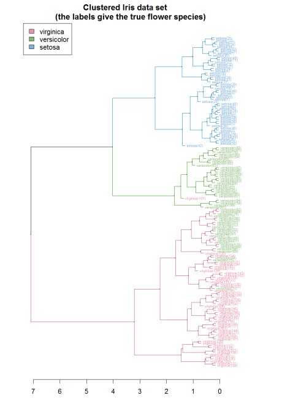
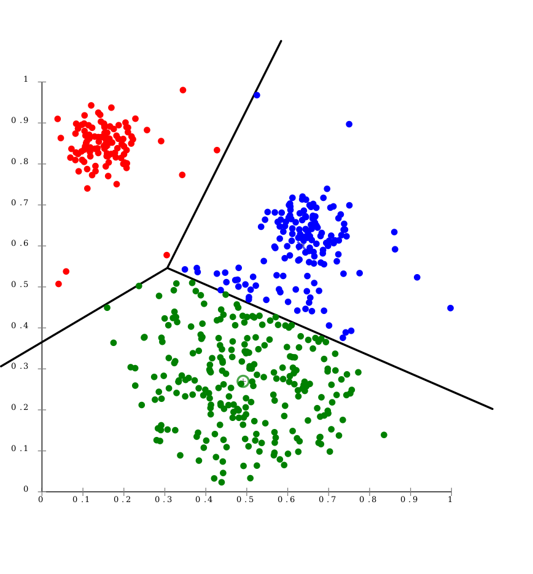

class: inverse, middle, center

# Final Project Discussion

```{r setup, include = FALSE}
knitr::opts_chunk$set(comment = "")
source("../slide_functions.R")
folder = "../imgs/unsupervised/"
knitr::opts_chunk$set(
  echo = TRUE,
  prompt = FALSE,
  message = FALSE,
  warning = FALSE,
  comment = ""
  )
library(RColorBrewer)
library(RSkittleBrewer)
library(ggplot2)
library(pheatmap)
theme_big = theme(text = element_text(size = 20))
```

---
class: inverse

## In approximate order of difficulty

.super[
* Descriptive
<br><br>
* Exploratory
<br><br>
* Inferential
<br><br>
* Predictive
<br><br>
* Causal
<br><br>
* Mechanistic
<br><br>
* Unsupervised/Supervised
]

---
class: inverse

## Supervised vs. unsupervised

.super[
Supervised

* You have an outcome YY and some covariates XX
<br><br>
* You typically want to solve something like $\arg\min_{f} E[(Y−f(X))^2]$

Unsupervised
* You have a bunch of observations X and you want to understand the relationships between them.
<br><br>
* You are usually trying to understand patterns in X or group the variables in X in some way
]


```{r face, results='asis', echo = FALSE}
bg_slide("face", 
  folder = folder,
  size = "35%",
  add_opts = "class: inverse",
  title = "Semi-supervised")
```

.footnote[http://static.googleusercontent.com/media/research.google.com/en/us/archive/unsupervised_icml2012.pdf]


---
class: inverse

## A few techniques for unsupervised

.super[
* Kernel density estimation
<br><br>
* Clustering
<br><br>
* Principal components analysis/SVD
<br><br>
* Factor analysis
<br><br>
* MDS/ICA/MFPCA/...
]

---
class: inverse

## Example: stamp thickness

```{r}
library(bootstrap)
str(stamp)
thick = stamp$Thickness
head(stamp)
```

```{r, echo = FALSE}
trop = RSkittleBrewer::RSkittleBrewer("tropical")
palette(trop)
```


---
class: inverse

## Summary statistics

.left-column-equal[
```{r, fig.width = 6, fig.height = 6}
ggplot(stamp, aes(y = Thickness, x = 1)) + 
  geom_boxplot(outlier.shape = NA) + 
  geom_jitter(height = 0) + theme_big
```
]
.right-column-equal[
```{r, fig.width = 6, fig.height = 6}
boxplot(thick); 
stripchart(thick, add =TRUE, vertical=TRUE, jitter=0.1, method = "jitter", pch=19, col=2)
```
]


```{r, results='asis', echo = FALSE}
bg_slide("binning", 
  folder = folder,
  size = "70%",
  positions = "bottom",
  add_opts = "class: inverse",
  title = "Binning")
```

---
class: inverse

## You've seen this: histograms

```{r, fig.width = 14, fig.height = 6}
par(mfrow=c(1,2))
hist(thick,col=2); hist(thick,breaks=100,col=2)
```

```{r, results='asis', echo = FALSE}
bg_slide("est_density", 
  folder = folder,
  size = "80%",
  positions = "bottom",
  add_opts = "class: inverse",
  title = "Estimating the density")
```


```{r, results='asis', echo = FALSE}
bg_slide("kde", 
  folder = folder,
  size = "60%",
  positions = "bottom",
  add_opts = "class: inverse",
  title = "Kernel density estimator")
```

---
class: inverse

## You've seen this, too

.left-column-equal[
```{r, fig.width = 6, fig.height = 6}
ggplot(stamp, aes(x = Thickness)) + 
  geom_density()
```
]
.right-column-equal[
```{r, fig.width = 6, fig.height = 6}
dens = density(thick); 
plot(dens, col=2)
```
]

---
class: inverse

## Make our own kde

```{r, fig.width = 12, fig.height = 6}
normer = function(x) dnorm(dens$x, mean=x, sd=dens$bw)/length(thick)
plot(dens$x, normer(thick[1]), type="l")
for(i in 1:length(thick)){
  lines(dens$x, normer(thick[i]), col=2)
}
```

---
class: inverse

## Make our own kde

```{r, fig.width = 12, fig.height = 6}
dvals = rep(0,length(dens$x))
for(i in 1:length(thick)){
  dvals = dvals + dnorm(dens$x,mean=thick[i],sd=dens$bw)/length(thick)
}
plot(dens,col=3,lwd=3); points(dens$x,dvals,col=2,pch=19,cex=0.5)
```

---
class: inverse, middle, center

# Exercise: How would we estimate the number of modes in a density estimate as a function of hh?


---
class: inverse

## One answer

.super[
```{r}
nmodes <- function(y) {
  x <- diff(y)
  n <- length(x)
  sum(x[2:n] < 0  & x[1:(n - 1)] >  0)
}
nmodes(dens$y)
```
]


```{r, results='asis', echo = FALSE}
bg_slide("smooth_ex", 
  folder = folder,
  size = "25%",
  add_opts = "class: inverse",
  title = "Smoothing example")
```
.footnote[http://genomicsclass.github.io/book/]

---
class: inverse

## Smoothing example


```{r, message = FALSE, warning=FALSE}
library(Biobase); library(SpikeIn); library(hgu95acdf); data(SpikeIn95)
##Example with two columns
i = 10; j = 9

##remove the spiked in genes and take random sample
siNames <- colnames(pData(SpikeIn95))
ind <- which(!probeNames(SpikeIn95) %in% siNames)
pms <- pm(SpikeIn95)[ind , c(i, j)]

##pick a representative sample for A and order A
Y = log2(pms[, 1]) - log2(pms[, 2])
X = (log2(pms[, 1]) + log2(pms[, 2])) / 2
set.seed(4)
ind <- tapply(seq(along = X), round(X * 5), function(i) {
  if (length(i) > 20) {
    return(sample(i, 20))
  } else { return(NULL)   }
})
ind <- unlist(ind); X <- X[ind]; Y <- Y[ind]
o <- order(X); X <- X[o]; Y <- Y[o]
```


---
class: inverse

## Smoothing example
```{r, fig.width = 9, fig.height = 6}
fit <- lm(Y ~ X); plot(X, Y); points(X, Y, pch = 21, bg = ifelse(Y > fit$fitted, 1, 3))
abline(fit, col = 2, lwd = 4, lty = 2)
```


---
class: inverse

## Bin smoothing
```{r, eval = TRUE}
centers <- seq(min(X), max(X), 0.1)
windowSize <- 1.25

i <- 25
center <- centers[i]
ind = which(X > center - windowSize & X < center + windowSize)
fit <- lm(Y ~ X, subset = ind)
```

---
class: inverse

## Bin smoothing
```{r, eval = TRUE}
plot(X, Y, col = "darkgrey", pch = 16); points(X[ind], Y[ind], bg = 3, pch = 21)
a <- min(X[ind]); b <- max(X[ind])
lines(c(a, b), fit$coef[1] + fit$coef[2] * c(a, b), col = 2, lty = 2, lwd = 3)
```


---
class: inverse

## Many windows

```{r}
windowSize <- 0.5
smooth <- rep(NA, length(centers))
for (i in seq(along = centers)) {
  center <- centers[i]
  ind = which(X > center - windowSize & X < center + windowSize)
  smooth[i] <- mean(Y[ind])
  if (i %% round(length(centers) / 12) == 1) {
    ##we show 12
    plot(X, Y, col = "grey", pch = 16)
    points(X[ind], Y[ind], bg = 3, pch = 21)
    lines(c(min(X[ind]), max(X[ind])),
          c(smooth[i], smooth[i]),
          col = 2,
          lwd = 2)
    lines(centers[1:i], smooth[1:i], col = "black")
    points(centers[i],
           smooth[i],
           col = "black",
           pch = 16,
           cex = 1.5)
  }
}
```

---
class: inverse

## The result

```{r}
par(mfrow=c(1,1))
plot(X,Y,col="darkgrey",pch=16)
lines(centers,smooth,col=2,lwd=3)
```

---
class: inverse

## Loess
.left-column-equal[
```{r, eval = TRUE}
centers <- seq(min(X), max(X), 0.1)
plot(X, Y, col = "darkgrey", pch = 16)
windowSize <- 1.25

i <- 25
center <- centers[i]
ind = which(X > center - windowSize & X < center + windowSize)
fit <- lm(Y ~ X, subset = ind)
points(X[ind], Y[ind], bg = 3, pch = 21)
a <- min(X[ind])
b <- max(X[ind])
lines(c(a, b), fit$coef[1] + fit$coef[2] * c(a, b), col = 2, lty = 2, lwd = 3)
```
]
.right-column-equal[
```{r, eval = FALSE}
i <- 60
center <- centers[i]
ind = which(X > center - windowSize & X < center + windowSize)
fit <- lm(Y ~ X, subset = ind)
points(X[ind], Y[ind], bg = 3, pch = 21)
a <- min(X[ind])
b <- max(X[ind])
lines(c(a, b), fit$coef[1] + fit$coef[2] * c(a, b), col = 2, lty = 2, lwd = 3)
```
]


---
class: inverse

## Final result for loess

```{r, fig.width = 9, fig.height = 6}
fit <- loess(Y ~ X, degree = 1, span = 1 / 3)
newx <- seq(min(X), max(X), len = 100)
smooth <- predict(fit, newdata = data.frame(X = newx))
plot(X, Y, col = "darkgrey", pch = 16); lines(newx, smooth, col = "black", lwd = 3)
```


```{r, results='asis', echo = FALSE}
bg_slide("loess", 
  folder = folder,
  size = "50%",
  add_opts = "class: inverse",
  title = "A big deal!")
```

.footnote[http://amstat.tandfonline.com/doi/abs/10.1080/01621459.1979.10481038
]


```{r, results='asis', echo = FALSE}
bg_slide("curse_dimensionality", 
  folder = folder,
  size = "65%",
  positions = "bottom",
  add_opts = "class: inverse",
  title = "Curse of dimensionality")
```

---
class: inverse

## Clustering - when you have many variables

.huge[
Clustering organizes things that are <font color="yellow">close</font> into groups

* How do we define close?
* How do we group things?
* How do we visualize the grouping?
* How do we interpret the grouping?
]

```{r, results='asis', echo = FALSE}
bg_slide("cluster_analysis", 
  folder = folder,
  size = "60%",
  add_opts = "class: inverse",
  title = "Another big one!")
```

.footnote[https://scholar.google.com/scholar?hl=en&q=cluster+analysis&btnG=]


```{r, results='asis', echo = FALSE}
bg_slide("distance", 
  folder = folder,
  size = "50%",
  add_opts = "class: inverse",
  title = "Defining close")
```

.footnote[http://rafalab.jhsph.edu/688/lec/lecture5-clustering.pdf]


```{r, results='asis', echo = FALSE}
bg_slide("euclid", 
  folder = folder,
  size = "60%",
  add_opts = "class: inverse",
  title = "Euclidean distance")
```

```{r, results='asis', echo = FALSE}
bg_slide("manhattan", 
  folder = folder,
  size = "50%",
  add_opts = "class: inverse",
  title = "Manhattan distance")
```

.footnote[http://en.wikipedia.org/wiki/Taxicab_geometry]


---
class: inverse

## Hierarchical clustering

.left-column-equal[

]
.right-column-equal[
.super[
An agglomerative approach
* Find closest two things
* Put them together
* Find next closest
Requires
* A defined distance
* A merging approach
Produces
* A tree showing how close things are to each other
]
]

---
class: inverse, center

## Hierarchical clustering - an example

```{r, results='asis', echo = FALSE}
set.seed(1234); par(mar=c(0,0,0,0))
x <- rnorm(12,mean=rep(1:3,each=4),sd=0.2)
y <- rnorm(12,mean=rep(c(1,2,1),each=4),sd=0.2)
plot(x,y,col="blue",pch=19,cex=2)
text(x+0.05,y+0.05,labels=as.character(1:12))
```

---
class: inverse

## Distances

```{r, fig.width = 6, fig.height = 6}
dataFrame <- data.frame(x = x, y = y); pheatmap(dist(dataFrame), cluster_rows = FALSE, cluster_cols = FALSE)
```

---
class: inverse

## Step one - find closest

```{r}
library(fields); dataFrame <- data.frame(x = x, y = y)
rdistxy <- rdist(dataFrame); diag(rdistxy) <- diag(rdistxy) + 1e5
ind <- which(rdistxy == min(rdistxy), arr.ind = TRUE)
```
```{r, echo = FALSE, fig.width = 6, fig.height = 6}
par(mar = rep(0.2, 4))
# Plot the points with the minimum overlayed
plot(x, y, col = "blue", pch = 19, cex = 2); text(x + 0.05, y + 0.05, labels = as.character(1:12))
points(x[ind[1, ]], y[ind[1, ]], col = "orange", pch = 19, cex = 2)
```

---
class: inverse

## Step one - find closest

```{r, fig.width = 12, fig.height = 6}
distxy = dist(dataFrame); hcluster = hclust(distxy)
dendro = as.dendrogram(hcluster); cutDendro = cut(dendro,h=(hcluster$height[1]+0.00001) )
```
```{r, fig.width = 12, fig.height = 6, echo = FALSE}
par(mfrow = c(1, 2), mar = rep(0.2, 4))
plot(cutDendro$lower[[11]],yaxt="n")
plot(cutDendro$lower[[5]],yaxt="n")
```


---
class: inverse

## Step two - merge closest

```{r, echo = FALSE, fig.width = 6, fig.height = 6}
par(mfrow=c(1,1), mar=rep(0.2,4))
plot(x,y,col="blue",pch=19,cex=2); text(x+0.05,y+0.05,labels=as.character(1:12))
points(x[ind[1,]],y[ind[1,]],col="orange",pch=19,cex=2)
points(mean(x[ind[1,]]),mean(y[ind[1,]]),col="black",cex=3,lwd=3,pch=3)
points(mean(x[ind[1,]]),mean(y[ind[1,]]),col="orange",cex=5,lwd=3,pch=1)
```


---
class: inverse

## Find next closest and repeat

```{r}
ind <- which(rdistxy == rdistxy[order(rdistxy)][3], arr.ind = TRUE)
```
```{r, echo = FALSE, fig.width = 6, fig.height = 6}
par(mar = rep(0.2, 4), mfrow = c(1,1))
# Plot the points with the minimum overlayed
plot(x, y, col = "blue", pch = 19, cex = 2)
text(x + 0.05, y + 0.05, labels = as.character(1:12))
points(x[c(5, 6)], y[c(5, 6)], col = "orange", pch = 19, cex = 2)
points(x[ind[1, ]], y[ind[1, ]], col = "red", pch = 19, cex = 2)
```


---
class: inverse

## Find next closest and repeat

```{r}
cutDendro <- cut(dendro, h = (hcluster$height[2]))
```

```{r, fig.width = 14, fig.height = 6, echo = FALSE}
par(mfrow=c(1,2))
plot(cutDendro$lower[[10]], yaxt = "n")
plot(cutDendro$lower[[5]], yaxt = "n")
```

---
class: inverse

## Hierachical clustering - hclust
```{r, fig.width = 8, fig.height = 6}
dataFrame <- data.frame(x=x,y=y); 
distxy <- dist(dataFrame); hClustering <- hclust(distxy)
```
```{r, fig.width = 8, fig.height = 6, echo = FALSE}
plot(hClustering)
```

```{r, results='asis', echo = FALSE}
bg_slide("merging", 
  folder = folder,
  size = "40%",
  add_opts = "class: inverse",
  title = "Merging points - complete")
```

```{r, results='asis', echo = FALSE}
bg_slide("merging_avg", 
  folder = folder,
  size = "40%",
  add_opts = "class: inverse",
  title = "Merging points - average")
```


```{r, results='asis', echo = FALSE}
bg_slide("linkage", 
  folder = folder,
  size = "60%",
  add_opts = "class: inverse",
  title = "What these choices look like")
```


---
class: inverse

## Hierarchical clustering

.left-column-equal[

]
.right-column-equal[
.super[
A partioning approach
* Fix a number of clusters
* Get "centroids" of each cluster
* Assign things to closest centroid
* Reclaculate centroids
Requires
* A defined distance metric
* A number of clusters
* An initial guess as to cluster centroids
Produces
* Final estimate of cluster centroids
* An assignment of each point to clusters
]
]


---
class: inverse

## K-means example

```{r}
x = rnorm(12, mean = rep(1:3, each = 4), sd = 0.2)
y = rnorm(12, mean = rep(c(1, 2, 1), each = 4), sd = 0.2)
```
```{r, echo = FALSE, fig.width = 6, fig.height = 6}
set.seed(1234); par(mar = c(0, 0, 0, 0)); 
plot(x, y, col = "blue", pch = 19, cex = 2); text(x + 0.05, y + 0.05, labels = as.character(1:12))
```

---
class: inverse

## K-means - starting centroids

```{r}
cx <- c(1,1.8,2.5); cy <- c(2,1,1.5)
```

```{r plotstuff, echo = FALSE, fig.width = 6, fig.height = 6}
par(mar=rep(0.2,4)); plot(x,y,col="blue", pch=19,cex=2); 
text(x + 0.05, y + 0.05, labels = as.character(1:12))
cols1 = c("red", "orange", "purple"); points(cx, cy, col = cols1, pch = 3, cex = 2, lwd = 2)
```
---
class: inverse

## K-means - assign to closest centroid

```{r, eval = FALSE} 
distTmp <- matrix(NA,nrow=3,ncol=12); d = function(i) (x-cx[i])^2 + (y-cy[i])^2;
distTmp[1,] <- d(1); distTmp[2,] <- d(2); distTmp[3,] <- d(3); 
newClust <- apply(distTmp,2,which.min); points(x,y,pch=19,cex=2,col=cols1[newClust])
```

```{r, echo = FALSE, fig.width = 5.5, fig.height = 5.5}
<<plotstuff>>
## Find the closest centroid
distTmp <- matrix(NA,nrow=3,ncol=12)
distTmp[1,] <- (x-cx[1])^2 + (y-cy[1])^2
distTmp[2,] <- (x-cx[2])^2 + (y-cy[2])^2
distTmp[3,] <- (x-cx[3])^2 + (y-cy[3])^2
newClust <- apply(distTmp,2,which.min)
points(x,y,pch=19,cex=2,col=cols1[newClust])
```


<!-- ***MISSING SLIDES HERE*** -->

---
class: inverse

## K-means

```{r} 
dataFrame <- data.frame(x,y)
kmeansObj <- kmeans(dataFrame,centers=3)
names(kmeansObj)
kmeansObj$cluster
```


```{r, results='asis', echo = FALSE}
bg_slide("model_based", 
  folder = folder,
  size = "70%",
  add_opts = "class: inverse",
  title = "Model based clustering")
```


```{r, results='asis', echo = FALSE}
bg_slide("em", 
  folder = folder,
  size = "50%",
  positions = "bottom",
  add_opts = "class: inverse",
  title = "Estimating parameters - EM like approach")
```

```{r, results='asis', echo = FALSE}
bg_slide("bayes", 
  folder = folder,
  size = "80%",
  add_opts = "class: inverse",
  title = "Select the number of clusters with Bayes factors")
```


```{r, results='asis', echo = FALSE}
bg_slide("faithful", 
  folder = folder,
  size = "40%",
  add_opts = "class: inverse",
  title = "Old faithful example")
```

.footnote[https://en.wikipedia.org/wiki/Old_Faithful]

---
class: inverse

## Update
```{r}
library(mclust); faithfulMclust <- Mclust(faithful)
summary(faithfulMclust,parameters=TRUE)
```

---
class: inverse

## Update
```{r}
plot(faithfulMclust)
```

---
class: inverse

## A pathological example
```{r}
clust1 = data.frame(x=rnorm(100),y=rnorm(100)); a = runif(100,0,2*pi)
clust2 = data.frame(x=8*cos(a) + rnorm(100),y=8*sin(a) + rnorm(100))
plot(clust2,col='blue',pch=19); points(clust1,col='green',pch=19)
```


---
class: inverse

## What happens
```{r}
dat = rbind(clust1,clust2); kk = kmeans(dat,centers=2); plot(dat,col=(kk$clust+2),pch=19)
```

---
class: inverse

## Clustering wrap-up

.super[
* Algomerative (h-clustering) versus divisive (k-means)
<br><br>
* Distance matters!
* Merging matters!
<br><br>
* Number of clusters is rarely estimated in advance
<br><br>
* H-clustering: Deterministic - but you don’t get a fixed number of clusters
<br><br>
* K-means: Stochastic - fix the number of clusters in advance
<br><br>
* Model based: Can select the number of clusters, may be stochastic, careful about assumptions!
]

