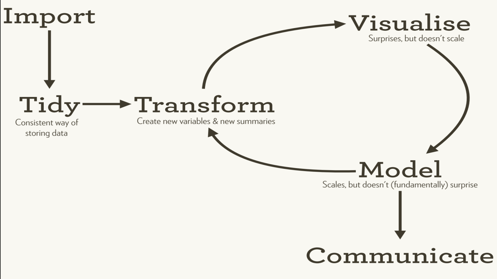
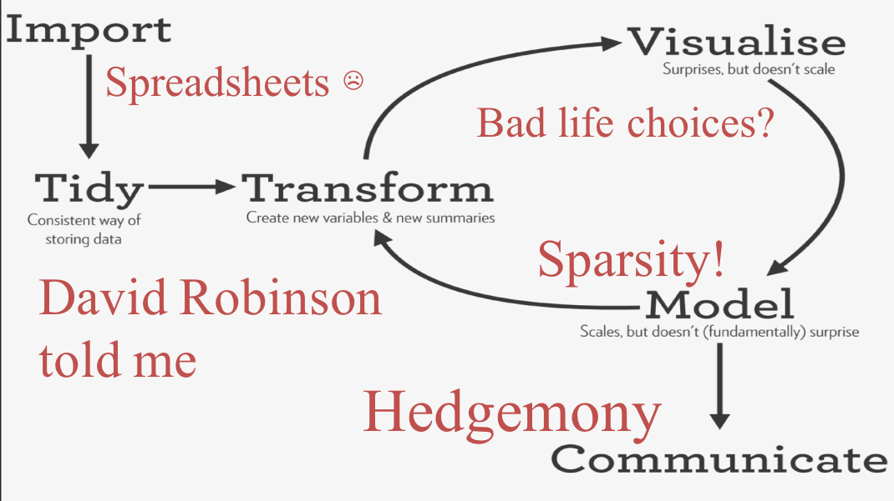

class: inverse, middle, center

# Modeling: one way of making sense of data

```{r setup, include = FALSE}
knitr::opts_chunk$set(comment = "")
source("../slide_functions.R")
folder = "../imgs/modeling/"
knitr::opts_chunk$set(
  echo = TRUE,
  prompt = FALSE,
  message = FALSE,
  warning = FALSE,
  comment = ""
  )
library(RColorBrewer)
library(RSkittleBrewer)
library(ggplot2)
library(pheatmap)
theme_big = theme(text = element_text(size = 20))
```

```{r, results='asis', echo = FALSE}
bg_slide("flowchart", 
  folder = folder,
  size = "50%",
  add_opts = "class: inverse")
```

.footnote[http://www.sciencemag.org/content/347/6228/1314]

```{r dogma, results='asis', echo = FALSE}
bg_slide("dogma",
  folder = folder,
  size = "90%",
  title = "Central dogma of statistics")
```

.footnote[http://www.gs.washington.edu/academics/courses/akey/56008/lecture/lecture2.pdf]


```{r, results='asis', echo = FALSE}
bg_slide("upshot",
  folder = folder,
  size = "90%"
)
```

```{r, results='asis', echo = FALSE}
bg_slide("princeton",
  folder = folder,
  size = "90%"
)
```

```{r, results='asis', echo = FALSE}
bg_slide("forecasts",
  folder = folder,
  size = "90%"
)
```

```{r, results='asis', echo = FALSE}
bg_slide("538",
  folder = folder,
  size = "70%"
)
```


---
class: inverse, middle, center

# .huge[Why did this happen?!?]


```{r, results='asis', echo = FALSE}
bg_slide("dogma_probability",
  folder = folder,
  size = "90%",
  title = "Central dogma of statistics")
```

.footnote[http://www.gs.washington.edu/academics/courses/akey/56008/lecture/lecture2.pdf]


```{r, results='asis', echo = FALSE}
bg_slide("dogma_inference",
  folder = folder,
  size = "90%",
  title = "Central dogma of statistics")
```

.footnote[http://www.gs.washington.edu/academics/courses/akey/56008/lecture/lecture2.pdf]


---
class: inverse, middle, center

# A better explanation <br><br> http://jtleek.com/advdatasci16/code/midterm2012


---
class: center, middle

## The data


```{r, results='asis', echo = FALSE}
bg_slide("pipeline",
  folder = folder,
  size = "25%")
```

.footnote[Leek and Peng, Nature 2015]


```{r, results='asis', echo = FALSE}
bg_slide("tidy",
  folder = folder,
  size = "90%")
```

---

.pull-left-third[
.huge[Who?<br><br>
What?<br><br>
When?<br><br>
Why?<br><br>
Where?<br>
<font color = "red"> How?</font>
]
]



---

.pull-left-third[
.huge[Who?<br><br>
What?<br><br>
When?<br>
<font color = "red"> Why?</font><br><br>
Where?<br><br>
How?
]
]



---
class: inverse

## Basic approach to model building and inference

.super[
1.  Hold out some data for evaluation
2.  Start with the simplest sensible model
3.  Plot the data and the model
4.  Look at residuals and model fit versus the data
5.  Augment with new variables
6.  Repeat this process
7.  Watch out for overfitting with 3-6!
8.  Evaluate the statistical significance on the held out data
]

---
class: middle, center

<!-- # $F_{0} \subseteq F_{0}(S) \subseteq F_{0}(Y)$ -->
# 

.footnote[Fithian, Sun and Taylor arXiv 2015]

---
class: middle, center

<!-- # F_{0} -->
# 

.huge[
σ-algebra: - what we know
]

---
class: middle, center

# 


.huge[
"we've done nothing"
]

---
class: middle, center
<!-- # F_{0}(S) -->
# 

.huge[
"we did model selection"
]
---
class: middle, center
<!-- # $F_{0}(Y)$ -->
# 

.huge[
"we looked at all the data"
]

---
class: middle, center

<!-- # E[\beta | F_{0}] \neq E[\beta | F_{0}(S)] -->
# 


```{r, results='asis', echo = FALSE}
bg_slide("eda", 
  folder = folder,
  size = "40%",
  add_opts = "class: inverse",
  title = "EDA is significance testing")
```

.footnote[http://vita.had.co.nz/papers/inference-infovis.pdf]


```{r, results='asis', echo = FALSE}
bg_slide("patil", 
  folder = folder,
  size = "80%"
  )
```

```{r, results='asis', echo = FALSE}
bg_slide("patil", 
  folder = folder,
  size = "80%"
  )
```

.pull-right-third[

]


```{r, results='asis', echo = FALSE}
bg_slide("perspectives", 
  folder = folder,
  size = "100%"
  )
```


```{r, results='asis', echo = FALSE}
bg_slide("scatter", 
  folder = folder,
  size = "50%"
  )
```

```{r, results='asis', echo = FALSE}
bg_slide("r4ds", 
  folder = folder,
  size = "45%",
  add_opts = "class: inverse"
  )
```

.footnote[http://r4ds.had.co.nz/model-building.html#introduction-16]


```{r, results='asis', echo = FALSE}
bg_slide("transparency", 
  folder = folder,
  size = "80%",
  add_opts = "class: inverse"
  )
```

```{r, results='asis', echo = FALSE}
bg_slide("religous", 
  folder = folder,
  size = "55%",
  add_opts = "class: inverse"
  )
```

```{r, results='asis', echo = FALSE}
bg_slide("upshot2", 
  folder = folder,
  size = "90%",
  add_opts = "class: inverse"
  )
```


```{r, results='asis', echo = FALSE}
bg_slide("falsepositive", 
  folder = folder,
  size = "80%",
  add_opts = "class: inverse"
  )
```

---
<!-- .huge[ -->
<!-- $$\begin{align} -->
<!-- F_0 &\subseteq F_{0}(1_{P,Q}(H)) \\ -->
<!-- &\subseteq F_{0}(1_{ED}(E)) \\ -->
<!-- &\subseteq F_{0}(1_{ED;E}(D)) \\ -->
<!-- &\subseteq F_{0}(1_{AP;A}(C)) \\ -->
<!-- &\subseteq F_{0}(1_{C}(A*)) -->
<!-- \end{align}$$ -->
<!-- ] -->
